# 前言

## HTTP 是什么？

简单的说 HTTP 是超文本传输协议。所谓**超文本**，就是"超越了普通文本的文本"，他是文字、图片、音频和视频等的混合体，最关键的是含有超链接。我们熟知的 HTML 就是一种"超文本"。传输就是计算机之间传输数据的约定和规范。协议是指使用计算机能够理解的语言确立的的一种计算机之间交流通信的规范，以及相关的各种控制和错误的处理方式。
总结来说，`HTTP 是一个在计算机世界里专门在两点之间传输文字、图片、音频、视频等超文本数据的约定和规范。`

## 与 HTTP 有关的各种概念

### 1. 浏览器

浏览器的正式名字叫 `Web Browser`，顾名思义，就是检索、查看互联网上资源的应用程序。`Web` 实际上指的就是 `World Wide Web`，也就是万维网。

浏览器本质上是 `HTTP` 协议中的请求方，使用 `HTTP` 协议获取网络上的各种资源。

在 `HTTP` 协议里，浏览器的角色被称为 `User Agent` 即 "用户代理"，意思是作为访问者的 "代理" 来发起 `HTTP` 请求。我们通常也简单的称之为 "客户端"。

### 2. Web 服务器

浏览器作为 `HTTP` 协议的请求方，服务器作为协议的响应方。它是 HTTP 协议里响应请求的主体，通常也把控着绝大多数的网络资源，在网络世界里处于强势地位。

### 3. CDN

浏览器和服务器是 `HTTP` 协议的两个端点，浏览器通常不会直接连接到服务器，中间会经过 "重重关卡"，CDN 就是其中一个重要的角色。

CDN，全称是“Content Delivery Network”（内容分发网络）。它应用了 HTTP 协议里的缓存和代理技术，代替源站响应客户端的请求。

那么，为什么要使用 CDN 呢？

简单来说，CDN 可以缓存服务器的数据，让浏览器的请求不用 "千里迢迢" 地到达源站服务器，直接在 "半路" 就可以获取响应。CDN 可以找到离浏览器最近的节点，直接返回缓存数据，大幅度缩短来响应时间。在网页开发中，我们经常将一些 JS 文件、图片等资源上传到 CDN 中，来优化网站的响应速度。

### 4. HTML

HTML 是 HTTP 协议传输的主要内容之一，它描述了超文本页面，用各种“标签”定义文字、图片等资源和排版布局，最终由浏览器“渲染”出可视化页面。

### 5. WebService

WebService 是一种 Web 应用程序，WebService 是一种跨编程语言和跨操作系统平台的远程调用技术。

Web Service 是一种由 W3C 定义的应用服务开发规范，使用 client-server 主从架构，通常使用 WSDL 定义服务接口，使用 HTTP 协议传输 XML 或 SOAP 消息，它是一个基于 Web（HTTP）的服务架构技术，既可以运行在内网，也可以在适当保护后运行在外网。

### 6. WAF

WAF 是一种 Web 应用程序防护系统（Web Application Firewall，简称 WAF），它是一种通过执行一系列针对 HTTP / HTTPS 的安全策略来专门为 Web 应用提供保护的一款产品，它是应用层面的防火墙，专门检测 HTTP 流量，是防护 Web 应用的安全技术。 WAF 通常位于 Web 服务器之前，可以阻止如 SQL 注入、跨站脚本等攻击。

## 与 HTTP 相关的各种协议

### 1. TCP/IP 协议

TCP/IP 协议是一系列网络通信协议的统称，其中最核心的两个协议是 **TCP** 和 **IP**，其他的还有 UDP、ICMP、ARP 等等，共同构成了一个复杂但有层次的协议栈。

这个协议栈有四层，从上至下依次是 "应用层"、"传输层"、"网络层"、"链接层"，TCP 和 IP 分别属于 "传输层" 和 "网络层"。接下来，我们先详细了解一下 TCP/IP 网络分层模型。

#### 1.1 应用层

应用层决定了向用户提供应用服务时通信的活动。

TCP/IP 协议族内预存了各类通用的应用服务。比如，FTP 和 DNS。HTTP 协议也处于该层。

#### 1.2 传输层

传输层对上层应用层，提供处于网络连接中两台计算机之间的数据传输。它的职责是保证数据在 IP 地址标记的两点之间 "可靠" 的传输。

传输层有两个性质不同的协议：TCP（Transmission Control Protocol，传输控制协议）和 UDP（User Data Protocol，用户数据报协议）

`TCP 是一个有状态的协议，需要先与对方建立连接然后才能发送数据，而且保证数据不丢失不重复。而 UDP 则比较简单，它无状态，不用事先建立连接就可以任意发送数据，但不保证数据一定会发到对方。两个协议的另一个重要区别在于数据的形式。TCP 的数据是连续的“字节流”，有先后顺序，而 UDP 则是分散的小数据包，是顺序发，乱序收`

#### 1.3 网络层

网络层用来处理在网络上流动的数据包。数据包是网络传输的最小数据单位。该层规定了通过怎样的路径到达对方的计算机，并把数据包传给对方。

#### 1.4 链接层

链接层用来处理连接网络的硬件部分。包括操作系统、硬件的设备驱动、光纤等物理可见部分。

#### TCP/IP 通信传输流

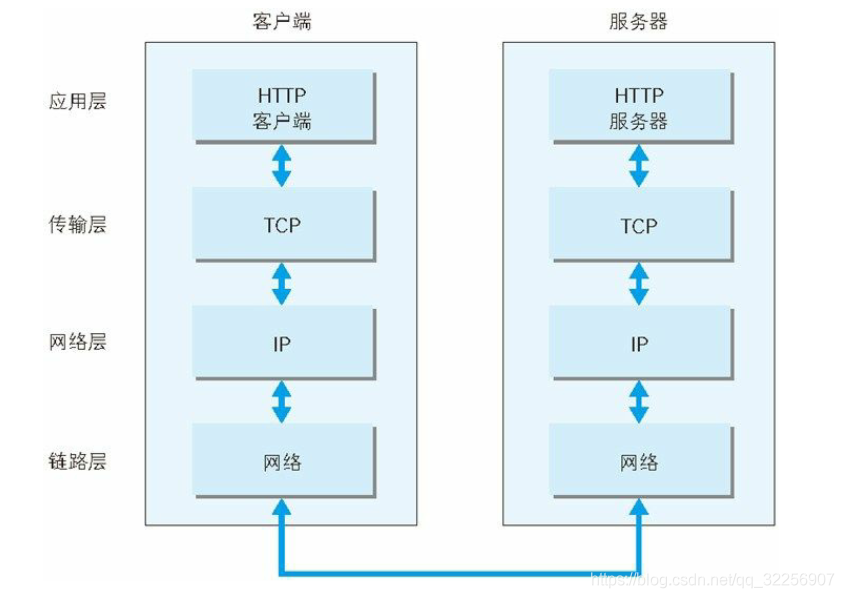

利用 TCP/IP 协议进行网络通信时，会通过分层顺序与对方进行通信。发送端从应用层开始往下走，接收端从链接层开始往上走。

我们用 HTTP 举例来说明：

首先作为发送端的客户端在应用层发出一个带有数据的 HTTP 请求。

接着，在传输层，TCP 协议会将 HTTP 协议发送的数据看作一个数据包，并在数据包的前面加上 TCP 包的一部分信息。

接着，在网络层，IP 协议会将 TCP 协议要发送的数据看作一个数据包，同样在这个数据包的前面加上 IP 协议的部首。

接着，在链接层，对应的协议也会在 IP 数据包前面加上以太网的部首。

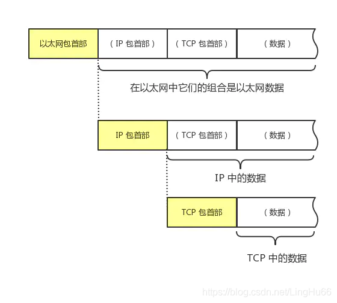

在接收端，数据链接层会使用对应的协议找到物理层的数据，经过解码得到以太网的部首信息和对应的 IP 数据包。再将 IP 数据包传给上层的网络层。

接着，网络层经过解码得到 IP 协议的首部和对应的 TCP 数据包。再将 TCP 数据包传给上层的传输层。

接着，传输层经过解码得到 TCP 协议的首部和对应的 HTTP 数据包，再将数据包传给上层的应用层。

接着，应用层就就得到从目标设备传送过来的数据。

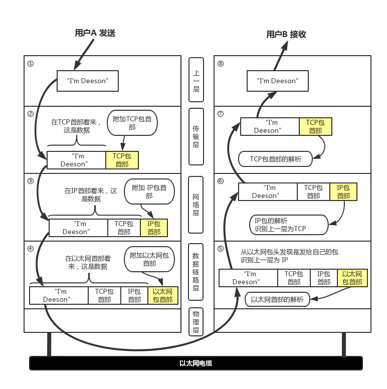

### 2. DNS

在 TCP/IP 协议中使用 IP 地址来标识计算机，但数字形式的地址难以记忆，于是**域名系统**（Domain Name System）就出现来，用有意义的名字来作为 IP 地址的等价替代。

在 DNS 中， "域名"又称为 "主机名"，为了更好地标记不同国家或组织的主机，让名字更好记，所以被设计成了一个有层次的结构。

域名用 “.” 分隔成多个单词，级别从左到右逐级升高，最右边的被称为 “顶级域名”。对于顶级域名，可能你随口就能说出几个，例如表示商业公司的“com”、表示教育机构的“edu”，表示国家的 “cn”、“uk” 等。

但想要使用 TCP/IP 协议来通信仍然要使用 IP 地址，所以需要把域名做一个转换，“映射” 到它的真实 IP，这就是所谓的 “**域名解析**”。

### 3. URI/URL

要访问网络上的资源，光有 TCP/IP 和 DNS 还不够。因为，DNS 和 IP 地址只是标记了互联网上的主机，但主机上有很多文本、图片、页面，我们并不能知道具体要访问的资源。

所以就出现了 URI（Uniform Resource Identifier），中文名称是 **统一资源标识符**，使用它就能够唯一地标记互联网上资源。

URI 另一个更常用的表现形式是 URL（Uniform Resource Locator），**统一资源定位符**，也就是我们俗称的 “网址”，它实际上是 URI 的一个子集，不过因为这两者几乎是相同的，差异不大，所以通常不会做严格的区分。

URI 主要由三个基本的部分组成：

1. 协议名：即访问该资源应当使用的协议，常见的有 HTTP、HTTPS、FTP。
2. 主机名：即互联网上主机的标记，可以是域名或者 IP 地址。
3. 路径：即资源在主机上的位置，使用 "/" 分隔多级目录。

就拿 Nginx 网站来举例，看一下 URI 是什么样子的。

```
http://nginx.org/en/download.html
```

其中，http 就是协议名，nginx.org 就是主机名，/en/download.html 就是路径。

### 4. HTTPS

在 TCP/IP、DNS 和 URI 的作用下， HTTP 协议可以在互联网世界里访问任意的网页。但是，HTTP 是明文传输的，这就意味着，在传输的任何节点数据都可以被窃听甚至篡改。这样是非常不安全的。

HTTPS 全称：超文本传输安全协议，常称为 HTTP over SSL/TLS，也就是运行在 SSL/TLS 协议上的 HTTP。SSL/TLS 是一个负责加密通信的安全协议，建立在 TCP/IP 之上，所以也是个可靠的传输协议，可以被用作 HTTP 的下层。

HTTPS 主要作用是：

- 对数据进行加密，并建立一个信息安全通道，来保证传输过程中的数据安全
- 对网站服务器进行真实身份认证

## HTTP 请求响应过程

我们以一道经典的面试题来学习一下 HTTP 请求响应过程。`在浏览器中输入网址（http://www.cijianshaonian.com/index.html）后，到底发生了什么事情？`

- 首先 DNS 服务器会对域名 www.cijianshaonian.com 进行解析，找到 www.cijianshaonian.com 多对应的 IP 地址，然后 HTTP 客户端进程会发起一个到服务器 www.cijianshaonian.com 的 TCP 连接，进行[三次握手](https://juejin.cn/post/7045059219216662564)。
- TCP 连接建立成功之后，客户端向服务器发送一个 HTTP 请求报文，该报文中包含了要访问的资源路径。
- 服务端接收到客户端发来的请求报文后，进行请求的解析，并检索出要访问的资源，并将检索出来的对象封装到 HTTP 响应报文中，向客户端进行发送。
- 服务端随即通知 TCP 断开 TCP 连接，实际上是需要等到客户端接受完响应报文后才会断开 TCP 连接。
- 客户端接收完响应报文后，TCP 连接会关闭。客户端从响应报文中获取要访问的资源，并呈现给用户。
  上述过程是一个简单的 `请求-响应` 过程，真实情况下会比这复杂很多，会涉及到缓存、代理等等，这些我们后面再详细了解。

### 1 什么是[三次握手](https://juejin.cn/post/7045059219216662564)

三次握手是建立 TCP 连接的过程，对应还有断开 TCP 连接的四次挥手。

1. 一开始，服务端和客户端都处于 CLOSE 状态。
2. 服务端主动监听某个端口，处理 LISTEN 状态。
3. 客户端随机生成序列号（这里的序列号一般叫做 client_isn），并且把标识位设置为 SYN，然后把该报文发送给服务端。
4. 客户端发送完 SYN 报文以后，自己便进入了 SYN_SEND 状态。
5. 服务端接收到了客户端的请求之后，自己也初始化对应的序列号（这里的序列号一般叫做 server_isn）。
6. 服务端在「确认号」字段里填上 client_isn + 1（相当于告诉客户端，已经收到了发送过来的序列号了） ，并且把 SYN 和 ACK 标记位都点亮(置为 1)，把该报文发送客户端，服务端的状态变成 SYN-REVD 状态。
7. 客户端收到服务端发送的报文后，就知道服务端已经接收到了自己的序列号（通过确认号就可以知道），并且接收到了服务端的序列号(server_isn)。
8. 此时，客户端需要告诉服务端自己已经接收到了他发送过来的序列号，所以在「确认号」字段上填上 server_isn+1，，并且标记位 ACK 为 1。
9. 客户端在发送报文之后，进入 ESTABLISHED 状态，而服务端接收到客户端的报文之后，也进入 ESTABLISHED 状态。

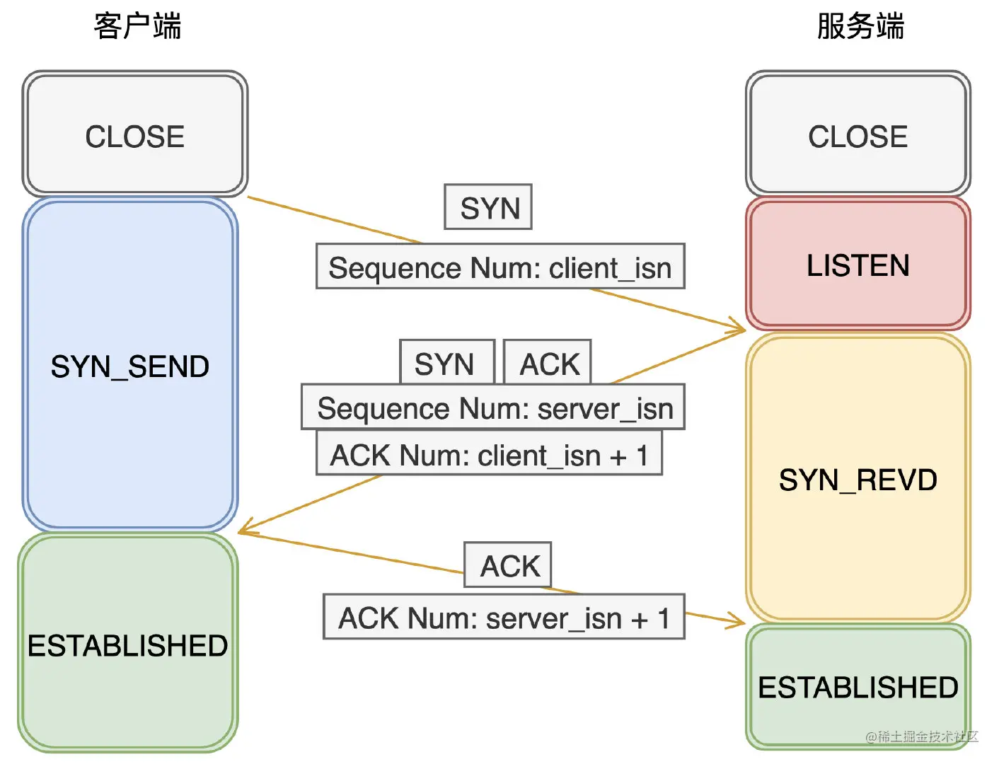

### 2 HTTP 报文是怎样的

HTTP 的请求报文是以 `header + body` 的结构，具体而言：

```
起始行 + 头部 + 空格 + 实体
```

#### 起始行

对于请求报文来说，起始行类似下面这样:

```
// 方法 + 路径 + http版本
GET /home HTTP/1.1
```

对于响应报文来说，起始行类似下面这样:

```
// http版本 + 状态码 + 原因
HTTP/1.1 200 OK
```

#### 头部

展示一下请求头和响应头在报文中的位置:

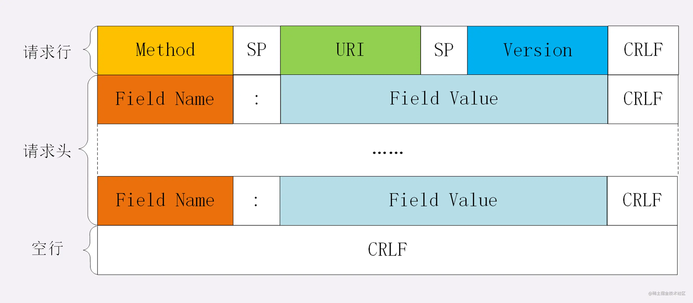

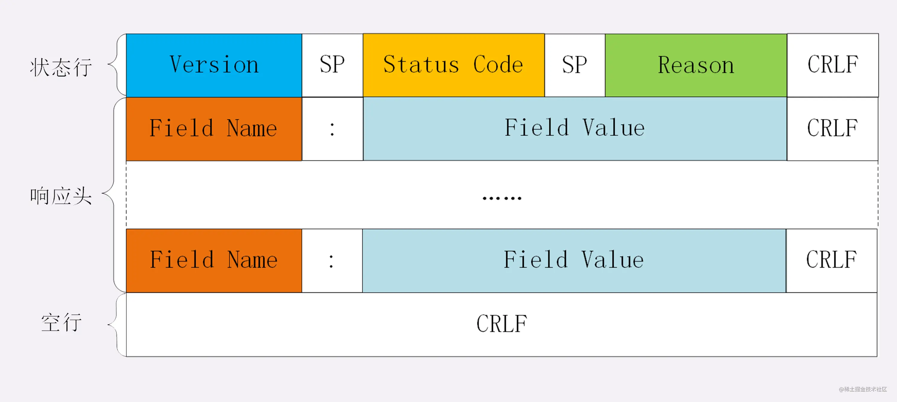

不管是请求头还是响应头，其中的字段是相当多的，而且牵扯到 http 非常多的特性，这里就不一一列举的，重点看看这些头部字段的格式：

1. 字段名不区分大小写
2. 字段名不允许出现空格，不可以出现下划线 `_`
3. 字段名后面必须紧接着 `:`

#### 空行

用来区分开 `头部` 和 `实体` 。空行后的内容全部被视为 `实体`。

#### 实体

就是具体的数据了，也就是 `body` 部分。请求报文对应请求体, 响应报文对应响应体。

### 3 HTTP 的请求方法

`http/1.1` 规定了以下请求方法:

- GET: 通常用来获取资源
- HEAD: 获取资源的元信息
- POST: 提交数据，即上传数据
- PUT: 修改数据
- DELETE: 删除资源(几乎用不到)
- CONNECT: 建立连接隧道，用于代理服务器
- OPTIONS: 列出可对资源实行的请求方法，用来跨域请求
- TRACE: 追踪请求-响应的传输路径

### 4 HTTP 的状态码

RFC 规定 HTTP 的状态码为三位数，被分为五类:

- 1xx: 表示目前是协议处理的中间状态，还需要后续操作。
- 2xx: 表示成功状态。
- 3xx: 重定向状态，资源位置发生变动，需要重新请求。
- 4xx: 请求报文有误。
- 5xx: 服务器端发生错误。

#### 1xx

101 Switching Protocols。在 HTTP 升级为 WebSocket 的时候，如果服务器同意变更，就会发送状态码 101。

#### 2xx

200 OK 是见得最多的成功状态码。通常在响应体中放有数据。

204 No Content 含义与 200 相同，但响应头后没有 body 数据。

206 Partial Content 顾名思义，表示部分内容，它的使用场景为 HTTP 分块下载和断点续传，当然也会带上相应的响应头字段 Content-Range。

#### 3xx

301 Moved Permanently 即永久重定向，对应着 302 Found，即临时重定向。

比如你的网站从 HTTP 升级到了 HTTPS 了，以前的站点再也不用了，应当返回 301，这个时候浏览器默认会做缓存优化，在第二次访问的时候自动访问重定向的那个地址。而如果只是暂时不可用，那么直接返回 302 即可，和 301 不同的是，浏览器并不会做缓存优化。

304 Not Modified: 当协商缓存命中时会返回这个状态码。

#### 4xx

400 Bad Request: 开发者经常看到一头雾水，只是笼统地提示了一下错误，并不知道哪里出错了。

403 Forbidden: 这实际上并不是请求报文出错，而是服务器禁止访问，原因有很多，比如法律禁止、信息敏感。

404 Not Found: 资源未找到，表示没在服务器上找到相应的资源。

405 Method Not Allowed: 请求方法不被服务器端允许。

406 Not Acceptable: 资源无法满足客户端的条件。

408 Request Timeout: 服务器等待了太长时间。

409 Conflict: 多个请求发生了冲突。

413 Request Entity Too Large: 请求体的数据过大。

414 Request-URI Too Long: 请求行里的 URI 太大。

429 Too Many Request: 客户端发送的请求过多。

431 Request Header Fields Too Large 请求头的字段内容太大。

#### 5xx

500 Internal Server Error: 仅仅告诉你服务器出错了，出了啥错咱也不知道。

501 Not Implemented: 表示客户端请求的功能还不支持。

502 Bad Gateway: 服务器自身是正常的，但访问的时候出错了，啥错误咱也不知道。

503 Service Unavailable: 表示服务器当前很忙，暂时无法响应服务。

### 5 HTTP 的请求头、响应头

#### Content-Type

Content-Type 用来标记发送端报文 `body` 部分的数据类型，对于接收端可以使用 Accept

具体取值可以分为下面几类：

- text： text/html, text/plain, text/css 等
- image: image/gif, image/jpeg, image/png 等
- audio/video: audio/mpeg, video/mp4 等
- application: application/json, application/javascript, application/pdf, application/octet-stream

<<< @/docs/http/code/src/accept/index.html

```js
const http = require('http')
const fs = require('fs')

function startHttp() {
  http
    .createServer((request, response) => {
      const html = fs.readFileSync('./src/accept/index.html')

      response.writeHead(200, {})
      response.end(html)
    })
    .listen(8888)
}

module.exports = startHttp
```

我们打开 `http://localhost:8888`，默认展现出来了 html 页面，效果如下：


现在，我们在服务端返回的时候加上 `Content-type`，并将它的类型设置为 `text/plain`:

```js
const http = require('http')
const fs = require('fs')

function startHttp() {
  http
    .createServer((request, response) => {
      const html = fs.readFileSync('./src/accept/index.html')

      response.writeHead(200, {})
      response.end(html)
    })
    .listen(8888)
}

module.exports = startHttp
```

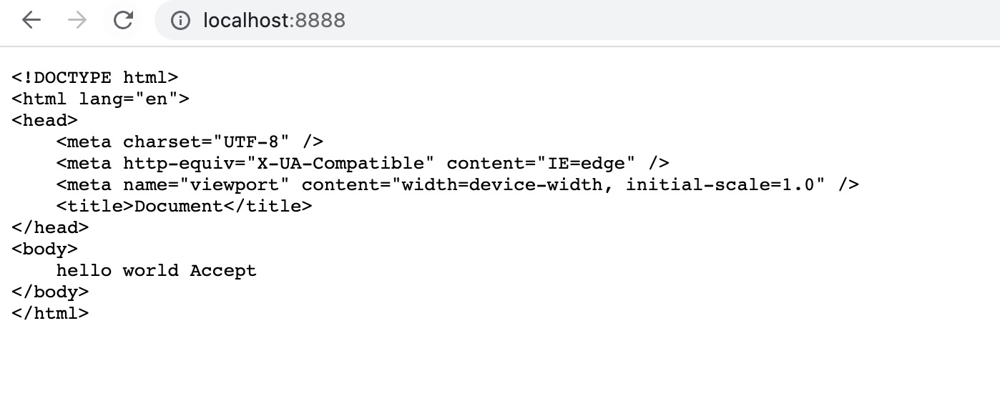

我们发现此时浏览器没有将服务端返回的内容识别成 `html` 文件。这是因为，我们在服务端的返回头里面指定了返回数据的 `Content-type` 为 `text/plain`。

若我们将 `Content-type` 改为 `text/html`，可以发现浏览器又能渲染出 html 内容了。这里就不在展示效果了。

接下来，我们看看 image application 的情况。

```js
// 在 http://localhost:8888 会展示成一张图片
const http = require('http')
const fs = require('fs')

function startHttp() {
  http
    .createServer((request, response) => {
      const image = fs.readFileSync('./src/accept/test.jpeg')

      response.writeHead(200, {
        'Content-type': 'image/jpeg'
      })
      response.end(image)
    })
    .listen(8888)
}

module.exports = startHttp
```

```js
// 在 http://localhost:8888 会展示成 JSON 数据
const http = require('http')
const fs = require('fs')

function startHttp() {
  http
    .createServer((request, response) => {
      response.writeHead(200, {
        'Content-type': 'application/json'
      })
      response.end(JSON.stringify({ name: '此间少年' }))
    })
    .listen(8888)
}

module.exports = startHttp
```

#### Content-Charset

`Content-Charset` 接收端对应为 `Accept-Charset`，指定可以接受的字符集，而在发送端并没有对应的 `Content-Charset`, 而是直接放在了 `Content-Type` 中，以 `charset` 属性指定。如:

```text
// 发送端
Content-Type: text/html; charset=utf-8

// 接收端
Accept-Charset: charset=utf-8
```

#### Content-Language

Content-Language 用来指定支持的语言，在接受方对应的字段为 `Accept-Language`。

```text
// 发送端
Content-Language: zh-CN, zh, en

// 接收端
Accept-Language: zh-CN, zh, en
```

#### Content-Encoding

Content-Encoding 用来标记发送端报文 `body` 的压缩方式，对于接收端可以使用 Accept-Content-Encoding。这个字段的取值有下面几种：

- gzip: 当今最流行的压缩格式
- deflate: 另外一种著名的压缩格式
- br: 一种专门为 HTTP 发明的压缩算法

```text
// 发送端
Content-Encoding: gzip

// 接收端
Accept-Encoding: gzip
```

我们对上面的例子做一个简单的修改，将 `Content-Encoding` 改为 `gzip`

<<< @/docs/http/code/src/accept/index.html

```js
const http = require('http')
const fs = require('fs')

function startHttp() {
  http
    .createServer((request, response) => {
      const html = fs.readFileSync('./src/accept/index.html')

      response.writeHead(200, {
        'Content-type': 'text/html',
        'Content-Encoding': 'gzip'
      })
      response.end(html)
    })
    .listen(8888)
}

module.exports = startHttp
```

此时，我们可以发现，页面不能正常的渲染了，这是因为，我们指定了服务端返回数据的压缩方式为 `gzip`，但是实际返回的数据并没有进行压缩处理。这里我们可以借助 `node` 自带的包 `zlib` 对文件 html 进行压缩处理后返回。

```js
const http = require('http')
const fs = require('fs')
const zlib = require('zlib')

function startHttp() {
  http
    .createServer((request, response) => {
      const html = fs.readFileSync('./src/accept/index.html')

      response.writeHead(200, {
        'Content-type': 'text/html',
        'Content-Encoding': 'gzip'
      })
      response.end(zlib.gzipSync(html))
    })
    .listen(8888)
}

module.exports = startHttp
```

将 `html` 文件内容压缩返回后，可以看到页面又能正常渲染了。

#### Content-length

`Content-length` 用来指明发送端传输数据包的长度。当 `Content-length` 设置的值小于数据包实际长度的时候，数据会在 http 的响应体中直接被截断了。当 `Content-length` 设置的值和数据包实际长度相同的时候，才能够正确的返回数据。

```js
const http = require('http')
const fs = require('fs')

function startHttp() {
  http
    .createServer((request, response) => {
      response.writeHead(200, {
        'Content-type': 'text/html',
        'Content-length': '8'
      })
      response.end('helloWorld')
    })
    .listen(8888)
}

module.exports = startHttp
```

#### Transfer-Encoding

上面我们说到可以通过 `Content-length` 来指定包的长度，实际上在数据传输的时候我们往往不知道包的实际长度，这时候就需要借助 `Transfer-Encoding`

`Transfer-Encoding` 表示分块传输数据，设置这个字段后会自动产生两个效果:

- Content-Length 字段会被忽略
- 基于长连接持续推送动态内容

```js
const http = require('http')
const fs = require('fs')

function startHttp() {
  http
    .createServer((request, response) => {
      response.writeHead(200, {
        'Content-type': 'text/html;charset=utf8',
        'Content-length': '8',
        'Transfer-Encoding': 'chunked'
      })
      response.write('hello, world')

      setTimeout(() => {
        response.write('<br/>你好，世界')
      }, 1000)

      setTimeout(() => {
        response.write('<br/>안녕, 세상.')
      }, 2000)
    })
    .listen(8888)
}

module.exports = startHttp
```

### Cookie

#### Cookie 简介

Cookie 本质上就是浏览器里面存储的一个很小的文本文件，内部以键值对的方式来存储。向同一个域名下发送请求，都会携带相同的 `Cookie`，服务器拿到 `Cookie` 进行解析，便能拿到客户端的状态。而服务端可以通过响应头中的 `Set-Cookie` 字段来对客户端写入`Cookie`。

```js
const http = require('http')
const fs = require('fs')

function startHttp() {
  http
    .createServer((request, response) => {
      const html = fs.readFileSync('./src/cookie/index.html')

      response.writeHead(200, {
        'Content-type': 'text/html',
        'Set-Cookie': 'id=123'
      })
      response.end(html)
    })
    .listen(8888)
}

module.exports = startHttp
```

如果要设置多个 `Cookie` 也可以使用数组：

```text
'Set-Cookie': ['id=123', 'address=shang_hai']
```

#### Cookie 有效期

Cookie 的有效期可以通过 Expires 和 Max-Age 两个属性来设置。

- Expires 即过期时间。
- Max-Age 用的是一段时间间隔，单位是秒，从浏览器收到报文开始计算。

```js
const http = require('http')
const fs = require('fs')

function startHttp() {
  http
    .createServer((request, response) => {
      const html = fs.readFileSync('./src/cookie/index.html')

      const expiresTime = new Date()
      expiresTime.setTime(expiresTime.getTime() + 10 * 1000)

      response.writeHead(200, {
        'Content-type': 'text/html',
        // max-age=10 设置 10s 后过期
        // expires 指定具体过期的时间
        'Set-Cookie': ['id=123;max-age=10', `address=shang_hai;expires=${expiresTime.toUTCString()}`]
      })
      response.end(html)
    })
    .listen(8888)
}

module.exports = startHttp
```

#### Cookie 作用域

关于作用域也有两个属性: `Domain` 和 `path`, 给 `Cookie` 绑定了域名和路径，在发送请求之前，发现域名或者路径和这两个属性不匹配，那么就不会带上 Cookie。值得注意的是，对于路径来说，`/` 表示域名下的任意路径都允许使用 `Cookie`。

```js
const http = require('http')
const fs = require('fs')

function startHttp() {
  http
    .createServer((request, response) => {
      const html = fs.readFileSync('./src/cookie/index.html')

      const host = request.headers.host

      if (host === 'httpstudy.com:8888') {
        response.writeHead(200, {
          'Content-type': 'text/html',
          'Set-Cookie': ['id=123;path=/name', `address=shang_hai;domain=httpstudy.com`]
        })
      }
      response.end(html)
    })
    .listen(8888)
}

module.exports = startHttp
```

#### Cookie 安全相关

如果 cookie 字段带上 `HttpOnly`，那么说明只能通过 HTTP 协议传输，不能通过 JS 访问，这也是预防 XSS 攻击的重要手段。

如果带上 `Secure`，说明只能通过 HTTPS 传输 cookie。

```js
const http = require('http')
const fs = require('fs')

function startHttp() {
  http
    .createServer((request, response) => {
      const html = fs.readFileSync('./src/cookie/index.html')

      response.writeHead(200, {
        'Content-type': 'text/html',
        'Set-Cookie': ['id=123;Secure', `address=shang_hai;HttpOnly`]
      })
      response.end(html)
    })
    .listen(8888)
}

module.exports = startHttp
```

### 缓存

HTTP 缓存分为 2 种，一种是强缓存，另一种是协商缓存。主要作用是可以加快资源获取速度，提升用户体验，减少网络传输，缓解服务端的压力。

#### 强缓存

强缓存不需要发送请求到服务端，直接读取浏览器本地的缓存。在 Chrome 的 Network 中显示的 HTTP 状态码是 200，size 显示为 Memory Cache（缓存存放在内存中）或 Disk Cache (缓存存放在硬盘中)，存放的位置是由浏览器控制的。是否强缓存由 Expires、Cache-Control 和 Pragma 属性共同来控制。

##### Cache-Control [](https://www.cnblogs.com/tlxf-blog/p/11078366.html)

`Cache-Control` 有以下常用的属性：

- max-age 设置缓存的有效时间，单位是秒
- no-cache 不使用强缓存，需要与服务器验证缓存是否有效
- no-store 禁止使用缓存（包括协商缓存），每次都向服务器请求最新的资源
- private 专用于个人的缓存，中间代理、CDN 等不能缓存此响应
- public 响应可以被中间代理、CDN 等缓存
- must-revalidate 在缓存过期前可以使用，过期后必须向服务器验证

<font size="3">1. max-age、max-stale、s-maxage</font>

代码中我们设置 max-age=20，按照我们的预想，当页面第二次访问的时候会命中缓存，20s 过后，缓存失效，再次访问页面需要重新发起请求。

<<< @/docs/http/code/src/cache/index.html
<<< @/docs/http/code/src/cache/index.js

当我们第一次访问页面的时候，可以在 NetWork 中看到如下截图:

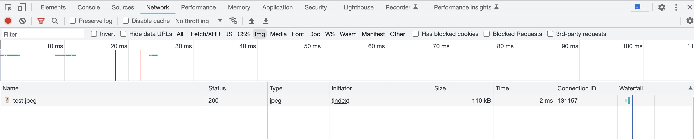

可以看出，图片的大小为 110KB， 请求时长 2ms，接着我们刷新页面，再次查看 NetWork：

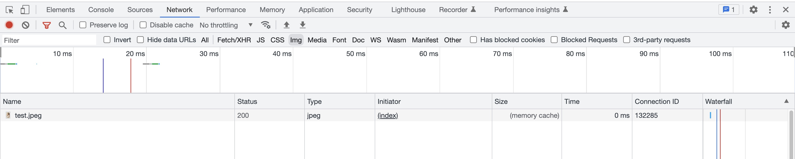
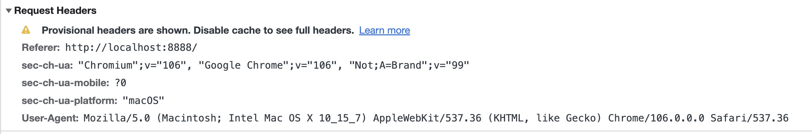

发现 Size 栏显示 memory cache，Time 栏显示加载时长 0ms。从请求的 Request Headers 可以看出来，我们此次请求并没有真的发送，而是走的浏览器缓存。

而 20s 后我们再次刷新页面的时候，可以看出资源又重新请求了。


当缓存过期之后，如果设置了 max-stale，只要还在 max-stale 时间内，就还可以使用过期的缓存，不需要重新请求。**max-stale 只有在发起发设置才有效**

s-maxage 与 max-age 指令相同，但是不同点是s-maxage指令只适用于供多位用户使用的公共缓存服务器（一般为代理），也可以说对于向同一用户重复返回响应的服务器来说，这个指令没有任何作用。同时，使用此字段后，expires 和 max-age 字段无效。

<font size="3">1. no-cache</font>

当请求首部中包含 no-cache 时则表示客户端将不会接收缓存过的响应，于是，中间的缓存服务器会把客户端请求转发给源服务器。

当响应首部中包含 no-cache 时则表示缓存服务器不对资源进行缓存。源服务器以后也将不再对缓存服务器请求中的资源进行有效性确认且禁止对其响应资源进行缓存操作。

当设置了 no-cache 的时候，每次都要将请求发送到服务器进行验证，可以配合 Last-Modified 或者 ETag 进行验证。

**Last-Modified**

当我们在 Response Header 设置了 'Cache-Control' 为 `no-cache`，并设置 `Last-Modified`，那么，在下次请求的时候，浏览器会将上一次 Response Header 中的 `Last-Modified` 作为本次 Request Header 的 `if-modified-since/if-unmodified-since` 的值传给服务端，浏览器通过比较文件的 `Last-Modified` 和 `if-modified-since/if-unmodified-since` 来判断文件是否已经更新，如果文件更新过，那么返回 200 状态码，如果文件没有更新，返回 304 状态码，告诉浏览器可以使用缓存文件。

<<< @/docs/http/code/src/cache/no-cache/index.html
<<< @/docs/http/code/src/cache/no-cache/index.js

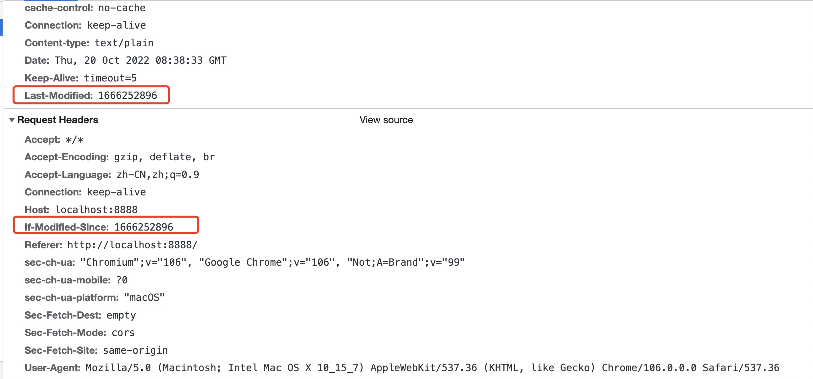

**ETag**

ETag 是资源对内容产生唯一的签名，当资源内容发生改变会生成一个新的签名。

ETag 的用法和 Last-Modified 类似，当我们在 Response Header 设置了 'Cache-Control' 为 `no-cache`，并设置 `ETag`，那么，在下次请求的时候，浏览器会将上一次 Response Header 中的 `ETag` 作为本次 Request Header 的 `if-none-match/if-match` 的值传给服务端，浏览器通过比较 `ETag` 和 `if-none-match/if-match` 值是否相同来判断是否命中缓存，命中则返回 304 状态码。否则，返回 200 状态码。

<<< @/docs/http/code/src/cache/no-cache-etag/index.html
<<< @/docs/http/code/src/cache/no-cache-etag/index.js

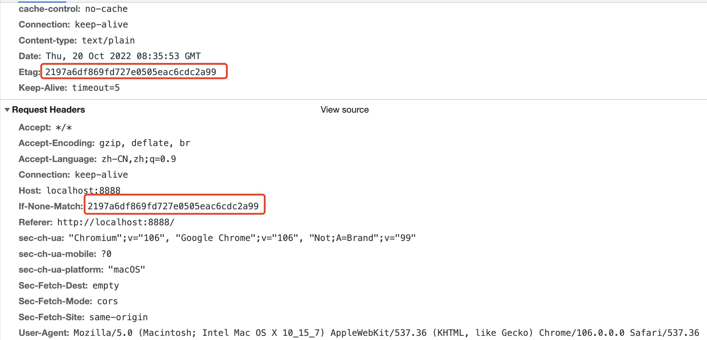

<font size="3">1. no-store</font>
当给 `Cache-Control` 设置了 `no-store` 表示不在本地存储请求和响应的任意部分。

<font size="3">1. must-revalidate</font>

must-revalidate 表示当缓存在有效期内，会直接使用浏览器缓存，不会发起服务端请求。当缓存过期了，客户端会再次发起请求（带有If-Modified-Since/If-None-Match请求头），如果服务端返回的状态码是 304，则客户端会根据该 304 响应所包含的一些响应头（Date、Last-Modified、Cache-Control等）重新计算出这条缓存的过期时间。

<<< @/docs/http/code/src/cache/must-revalidate/index.html
<<< @/docs/http/code/src/cache/must-revalidate/index.js

我们运行以上案例，刷新页面后连续点击获取数据按钮。

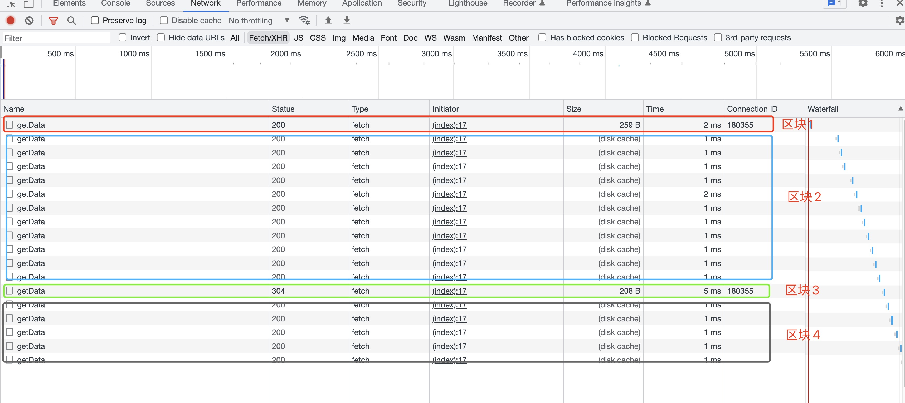

可以看到，"区块 1" 是我们第一次访问的时候，发送了服务端请求，服务端返回了 200。"区块 2" 是我们在 5s 时间内（也就是缓存有效期内 max-age=5）点击按钮的时候，并没有发起服务端请求，而是直接使用了浏览器缓存数据。 "区块 3" 是缓存到期后，我们再次发起服务端请求，服务端经过验证，发现缓存没有过期，于是返回 304 状态码，此时浏览器根据服务端返回的数据会刷新缓存有效期。"区块 4" 是当缓存有效期更新后，再次获取数据又直接走浏览器缓存。


### Redirect

### Connection

### Content-Security-Policy

### Nginx

```shell
// 查看 nginx 安装目录
weheris nginx

// 启动 nginx
systemctl start nginx

// 停止 nginx
systemctl stop nginx

// 启动 nginx
systemctl reload nginx

// 强制重启 nginx
systemctl restart nginx

// 设置开机启动 nginx
systemctl enable nginx

// 查询 nginx 状态
systemctl status nginx

// 代理缓存       存放目录  是否创建二级文件夹   10m 缓存大小
proxy_cache_path cache levels=1:2 keys_zone=my_cache:10m
// 使用代理缓存的时候 往往需要和 response header  Vary 一起使用

server {
  listen    80;
  server_name test.com;

  location / {
    proxy_cache my_cache; // 使用代理缓存
    proxy_pass http://127.0.0.1:8888; // 表示所有的请求都代理到这个地方
    proxy_set_header Host $host;
  }
}

```
