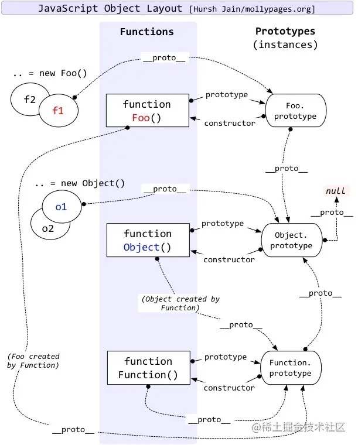
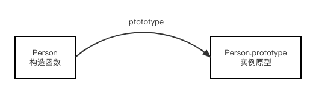
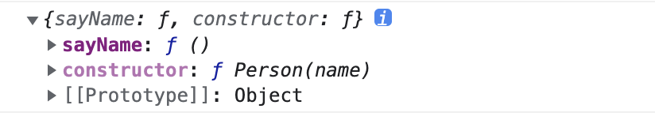
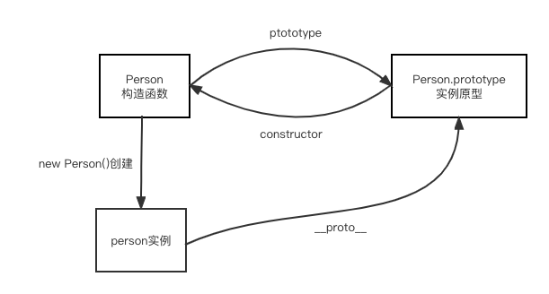
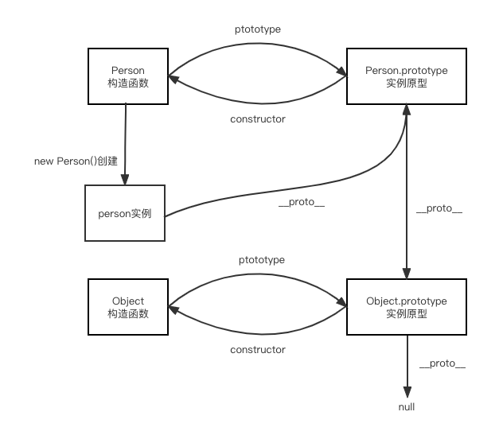

# 原型和原型链

### 前言

关于原型和原型链，网上有一张经典的关系图，不了解的同学可能看到这张图会很懵。没关系，当你看完我下面的介绍，相信你一定能够看懂的。


### `prototype`

每一个构造函数都有一个 `prototype`(显示原型) 属性，那构造函数的 prototype 属性到底指向的是什么呢？

我们先来看一个简单的例子：

```js
function Person(name) {
  this.name = name;
}
Person.prototype.sayName = function () {
  console.log(`my name is ${this.name}`);
};

const person1 = new Person("小明");
person1.sayName(); // my name is 小明
```

其实，构造函数的 `prototype` 属性是一个对象，这个对象是在调用构造函数的时候创建的**实例**的原型，在上述例子中，我们通过构造函数 `Person` 创建出实例对象 `person1`， `Person.prototype` 也就是 `person1` 的原型。我们可以用下面这张图来描述一下构造函数和实例原型的关系：



那么什么是原型呢？我们可以理解为每一个对象在创建的时候都会与另外一个对象关联，这个对象就是我们所说的原型，每一个对象都会从原型继承属性。在上述例子中，我们通过构造函数 `Person` 创建了实例对象 `person1`, 它继承了原型对象的 `sayName` 方法。

那么，我们怎么表示实例对象 `person1` 与原型 `Person.prototype` 的关系呢？接下来我们介绍第二个属性 `__proto__`。

### `__proto__`

每个 Javascript 对象都有一个属性，叫`__proto__`(隐式原型)，它指向该对象的原型。我们可以对上面的例子进行补充来证明这一点：

```js
function Person(name) {
  this.name = name;
}
Person.prototype.sayName = function () {
  console.log(`my name is ${this.name}`);
};

const person1 = new Person("小明");
person1.__proto__ === Person.prototype; //true
```

打印 `person1.__proto__` 可以看到以下信息



细心的同学已经发现原型对象上不仅仅有我们定义的 `sayName` 方法，还有一个神秘的方法 `constructor`，接下来我们介绍一下什么是 `constructor`。

### `constructor`

每个原型对象都有一个 `constructor`(构造方法)属性，它指向其关联的构造函数。所以我们可以得出以下结论：
`Person === Person.prototype.constructor`，我们用以下代码来证明这一点:

```js
function Person() {}

Person === Person.prototype.constructor; // true
```

至此，我们知道了实例通过 `__proto__`、构造函数通过 `prototype` 可以指向原型，原型通过`constructor`指向构造函数，我们可以对上面的关系图再加以补充：



### 原型链

在第一个例子中，我们讲到过 **每一个对象都会从原型继承属性**，所以实例`person1`可以访问到原型`Person.prototype`上的`sayName`方法。那如果我们访问一个原型`Person.prototype`上没有的属性呢，他是不是会返回 `undefined` 呢？

我们以访问属性 `valueOf` 来分析一下:

实例`person1` 的原型是 `Person.prototype`，当我们访问`valueOf`属性的时候，它会先到到实例`person1`上查找(`person1.valueOf`)，发现没有该属性，继而再到`Person.prototype`上去查找(`Person.prototype.valueOf`)，也没有找到。然而，`Person.prototype` 是一个 `Object` 实例，我们说”当实例对象上不能找到属性的时候，应该到它的原型对象中查找。“ `Person.prototype` 的原型是 `Object.prototype`，而 `Object.prototype` 上是存在 `valueOf` 属性的，所以我们最终得到应该是 `Object.valueOf`。

所以，当我们访问一个实例对象的属性时，他会先查询该实例本身的属性，然后再到实例的原型中查找，然后再到实例的原型的原型中查找...这样一层层地向上查找，当能够找到该属性时就停止向上查找的过程，而如果直到 `Object.prototype` 也没能找到该属性，就返回 `undefined`。

所以，最终的关系图如下：


