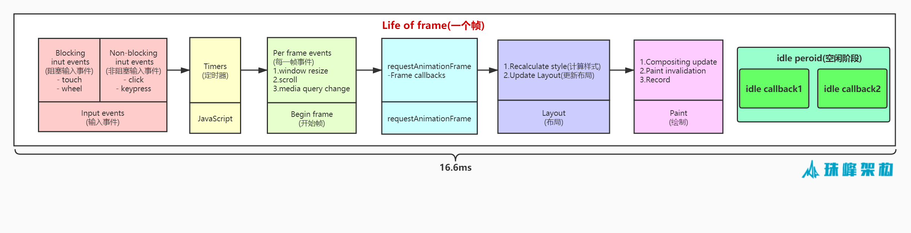
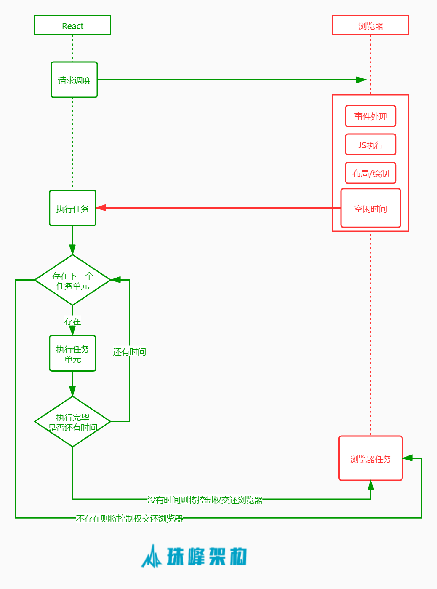
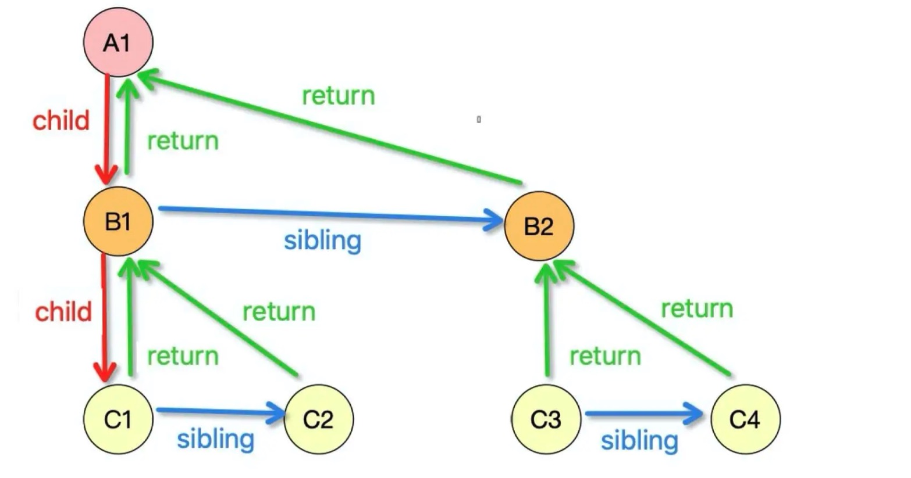
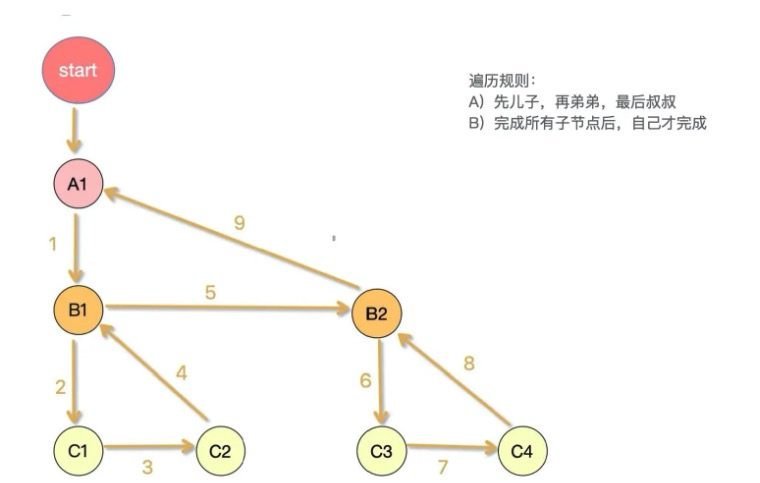

# Fiber 架构

## 为什么需要 Fiber
我们知道，在浏览器中，页面是一帧一帧的绘制出来的，主流浏览器的刷新频率是 60次/秒，每个帧的预算时间是 16.66 毫秒 (1 秒/60)
。当每秒内绘制的帧数（FPS）超过60时，页面渲染是流畅的；而当FPS小于60时，会出现一定程度的卡顿现象。下面来看完整的一帧中，具体做了哪些事情：

JavaScript 执行 Javascript 引擎和页面渲染引擎在同一个渲染线程,GUI 渲染和 Javascript 执行两者是互斥的，如果某个任务执行时间过长，浏览器会推迟渲染。例如在定时器阶段或Begin Frame阶段执行时间非常长，时间已经明显超过了16ms，那么就会阻塞页面的渲染，从而出现卡顿现象。

在 React16 之前，react 的 dom-diff 是采用递归遍历 DOM 树，找出需要修改的节点，然后再进行更新。这种递归遍历一旦开始就不能中断，如果一个 DOM 节点的层次足够深，那么遍历节点所用的时间就会增加，如果遍历计算耗时 100ms，那么这 100ms浏览器是无法响应的，代码执行时间越长卡顿越明显。

为了解决这个问题， React 在 16 版本之后引入了 Fiber 架构。将渲染/更新过程拆分为一个个小块的任务，通过合理的调度机制来调控时间，指定任务执行的时机，从而降低页面卡顿的概率，提升页面交互体验。通过 Fiber 架构，将原来的递归遍历的过程改为可中断和恢复。适时地让出CPU执行权，可以让浏览器及时地响应用户的交互。

## 什么是 Fiber 架构

Fiber 是一个一个执行单元，Fiber 也是一种数据结构。

### 一个执行单元

Fiber 是一个执行单元，每次执行完一个执行单元， React 就会检查现在还剩多少时间，如果没有时间就将控制权让出去。

### 一种数据结构

React Fiber 是采用链表的数据结构实现的，React 将 虚拟DOM树 转换成 Fiber 树，每个虚拟DOM的节点都是一个FiberNode，每个 FiberNode 都有 child（指向自己的第一个子节点）、sibling（指向自己的下一个兄弟节点）、return（指向自己的父节点）。

## Fiber 执行原理

从根节点开始渲染和调度的过程可以分为两个阶段：render 阶段、commit 阶段。

- render 阶段：这个阶段是可中断的，会找出所有节点的变更。
- commit 阶段：这个阶段是不可中断的，会执行所有的变更。

### render 阶段

此阶段会找出所有节点的变更，如节点新增、删除、属性变更等，此阶段会构建一棵 Fiber tree，以虚拟 dom 节点为维度对任务进行拆分，即一个虚拟 dom 节点对应一个任务，从中可以知道哪些节点更新、哪些节点增加、哪些节点删除了。

#### 遍历 流程

React Fiber首先是将虚拟DOM树转化为 Fiber tree，因此每个节点都有 child、sibling、return 属性，遍历 Fiber tree 标记节点的操作类型：

相关文章：

[淘系前端团队: 走进React Fiber的世界](https://juejin.cn/post/6943896410987659277#heading-15)
