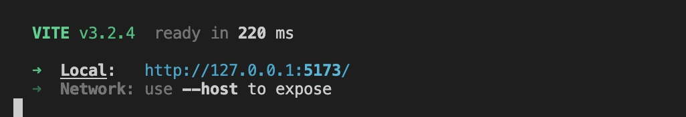
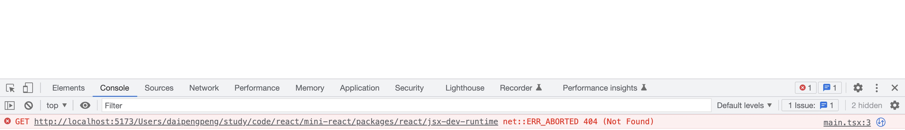
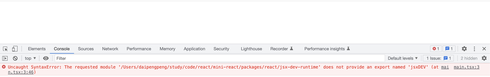
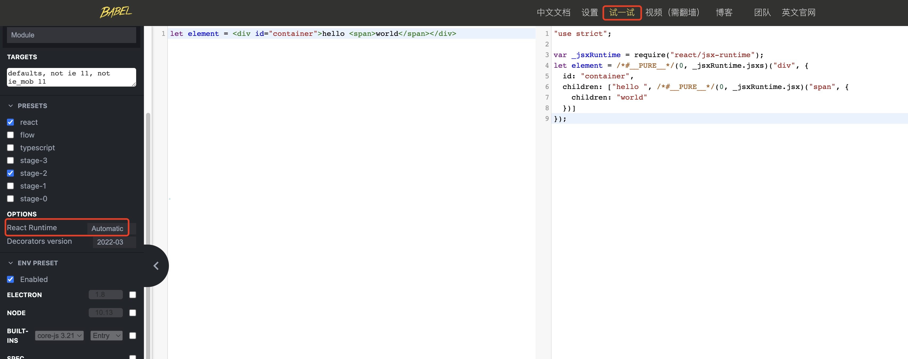
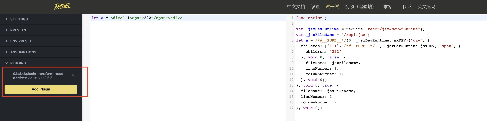

# 初始化项目

## 基于 pnpm 搭建 monorepo 项目

1. 创建项目文件夹

首先，第一步我们先创建一个项目文件夹：

```shell
mkdir mini-react
cd mini-react
npm init -y
```
创建 `packages` 文件夹用来存放 `react` 源码相关的文件, 创建 `demo` 文件夹用来存放案例代码。

```shell
mkdiir packages
mkdiir demos
```

创建 `pnpm-workspace.yaml` 文件，配置 workspace:

```yaml
packages:
  - 'packages/*'
```

2. 利用 `Vite` 运行 `demo`

```shell
cd init-react
pnpm install vite -D -w
pnpm install @vitejs/plugin-react -D -w
pnpm install typescript -D -w
```
在 `demos` 文件夹下创建 `vite.config.ts` 用来存放 `vite` 相关的配置，创建 `tsconfig.json` 用来存放 `typescript` 相关的配置
```ts
// vite.config.ts
import { defineConfig } from 'vite'
import react from '@vitejs/plugin-react'

export default defineConfig({
  plugins: [react()]
})
```

```json
// tsconfig.json
{
  "compilerOptions": {
  "target": "ESNext",
    "useDefineForClassFields": true,
    "lib": ["DOM", "DOM.Iterable", "ESNext"],
    "allowJs": false,
    "skipLibCheck": true,
    "esModuleInterop": false,
    "allowSyntheticDefaultImports": true,
    "strict": true,
    "forceConsistentCasingInFileNames": true,
    "module": "ESNext",
    "moduleResolution": "Node",
    "resolveJsonModule": true,
    "isolatedModules": true,
    "noEmit": true,
    "jsx": "react-jsx"
},
  "include": ["/"]
}
```
在 `demos` 文件夹下创建 `v1` 文件夹，用来存放我们第一个 `demo`

在 v1 文件夹下创建 `index.html` 和 `main.tsx`, 内容分别为下：
```html
// index.html
<!DOCTYPE html>
<html lang="en">
<head>
    <meta charset="UTF-8" />
    <title>Demo V1</title>
</head>
<body>
    <div id="root"></div>
    <script type="module" src="/main.tsx"></script>
</body>
</html>
```

```tsx
// main.tsx
import React from 'react'

import { createRoot } from 'react-dom/client'

const root = createRoot(document.getElementById('root'))

const element = <div>hello world</div>

root.render(element)
```

安装 React 和 React-DOM
```shell
pnpm install react react-dom -D -w
```

在 `package.json` 中配置 `demo:v1` 的启动命令：
```json
{
  "scripts": {
    "demo:v1": "vite serve demos/v1 --config demos/vite.config.js --force"
  }
}
```
随后，我们可以在命令行输入如下命令：
```shell
npm run demo:v1
```


打开 [http://127.0.0.1:5173/](http://127.0.0.1:5173/) 可以正常显示页面。


至此，我们的 `demo` 就可以正常显示来。后续我们可以将 `react` 和 `react-dom` 的引用改为自己的源码目录，这样我们就可以进行调试了。

3. 创建 React 包

在 `packages` 目录下创建 `react` 文件夹，并在 `react` 文件夹下执行 `npm init -y`
```shell
cd packages
mkdir react
npm init -y
```
在 `react` 目录下新建 `index.ts`：
```ts
export  default  {}
```

我们先把 `demo:v1` 下的 `main.tsx` 修改一下：
```tsx
import React from 'react'
const element = <div id="container">hello world</div>
```

接下来，需要在 `vite.config.ts` 中配置 `resolve.alias` 将 `react` 的引用改为 `packages/react`

```ts
import path from 'path'
export default defineConfig({
  // ...省略其他配置
  resolve: {
    alias: [
      {
        find: 'react',
        replacement: path.resolve(__dirname, '../packages/react')
      }
    ]
  }
})
```

此时，我们重新运行 `demo`，



我们发现页面报错了，并且提示我们找不到 `react/jsx-dev-runtime` 的文件，

那么，我们按照提示创建一下该文件：

```shell
cd packages/react
mkdir jsx-dev-runtime
```
再次重新运行 `demo`:



此时浏览器又报了另外一个错误，提示我们没有导出 `jsxDEV` 的方法，

那么，我们在 `react/jsx-dev-runtime` 文件里创建该方法并导出，

```ts
export function jsxDEV() {
  console.log('jsxDEV')
}
```
此时浏览器没有抛出错误，且正常打印了 `jsxDEV`。那么，我们为什么要这样做呢？

我们知道，浏览器是不认识 `tsx|jsx` 这种写法的，所以，我们需要将 `tsx|jsx` 进行一次转换，转换成浏览器可识别的语言。

在 `vite.config.ts` 中，我们引入了 `@vitejs/plugin-react` 插件。其实 `@vitejs/plugin-react` 就是帮我们把写的 `tsx|jsx` 语法转换成浏览器可识别的语言。它的内部其实是通过 `@babel/plugin-transform-react-jsx` 这个`babel`插件来实现的。

我们可以打开 `babel` 的[官网](https://www.babeljs.cn/)，点击上面的**试一试**

在左侧编辑器中写入我们的 `JSX` 语法，`OPTIONS` 选择 `Automatic`，右侧就是 `@babel/plugin-transform-react-jsx` 转换之后的代码。



可以看出，我们写的 `jsx` 语法最终都会被转成一个 `jsx` 的方法。为什么不是 `jsxDEV` 呢？因为，我们这边通过 `babel` 转的是 `production` 环境，而在运行 `demo` 的时候是 `development`。

我们可以添加 `@babel/plugin-transform-react-jsx-development` 这样一个插件，点击 `Add Plugin` 进行添加：



添加完成之后，可以看到 `jsx` 都转成了 `jsxDEV` 方法。

4. 创建 React-Dom 包

在 `packages` 目录下创建 `react-dom` 文件夹，并在 `react-dom` 文件夹下执行 `npm init -y`
```shell
cd packages
mkdir react
npm init -y
```

在 `react-dom` 目录下新建 `index.ts`：
```ts
export  default  {}
```

我可以看一下 `demo` 中 `main.tsx` 中的代码，

```tsx
import { createRoot } from 'react-dom/client'

const root = createRoot(document.getElementById('root'))
```
可以看出 `react-dom/client` 导出了一个 `createRoot` 的方法，该方法接收一个参数，并返回一个 `render` 方法。

那么，我们可以在 `react-dom` 下创建 `client.ts`、`src/client/ReactDOMRoot.ts` 文件，

```ts
// src/client/ReactDOMRoot.ts
function ReactDOMRoot() {}

ReactDOMRoot.prototype.render = function () {
  console.log('render')
}

export function createRoot() {
  return new (ReactDOMRoot as any)()
}
```

```ts
//client.ts
export { createRoot } from './src/client/ReactDOMRoot'
```

同样的，我们需要在 `vite.config.ts` 中配置 `resolve.alias` 将 `react-dom` 的引用改为 `packages/react-dom`

```ts
import path from 'path'
export default defineConfig({
  // ...省略其他配置
  resolve: {
    alias: [
      {
        find: 'react-dom',
        replacement: path.resolve(__dirname, '../packages/react-dom')
      }
    ]
  }
})
```

重新启动项目，可以看到控制台成功打印了 `render` 字符串。至此，我们项目的基本目录结构就完成了。

## 引入 eslint、prettier
关于 `eslint` 和 `prettier` 的配置，这里就不过多介绍了，可以参考 [lint 配置](/vite/base/vite-lint/)。

至此，我们项目的开发环境就算完成了，接下来我们将完成 JSX 的转换。

本节代码： [](https://github.com/dpp050700/mini-react/tree/react18-v1)