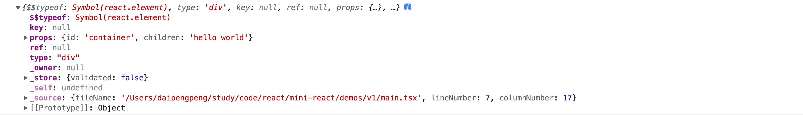

# JSX 转换

上一章我们有讲到，react 在开发环境会将 jsx 转换为名为 jsxDEV 的方法。对于该方法的定义实际上是在 react/src/ReactElement.ts 的文件夹下面。

那么，我们先创建一下这个文件：

```shell
cd packages/react/src
mkdir ReactElement.ts
```
我们可以先看一下 `jsxDEV` 函数调用后返回的产物，在 `demo/v1/main.tsx` 中我们可以进行 `console` 打印：

注意：这里要使用官方的 `React` 库，暂时把 `vite.config.ts` 中配置的 react 别名取消掉。

```tsx
const element = <div id="container">hello world</div>

console.log(element)
```
打开浏览器控制台，可以看到具体打印如下：



可以看出，`jsxDEV` 最终返回的是一个对象，其中几个重要的属性如下：
```js
let element = {
  $$typeof: '表示 ReactElement 的类型',
  key: 'ReactElement 唯一标识',
  props: 'ReactElement 的属性',
  ref: '',
  type: '标签的具体类型 div、span'
}
```

那么，我们现在就可以在 `react/src/ReactElement.ts` 来写具体的方法了。

在此之前，我们要再创建一个包文件夹 `shared`，该包里面会放一些类型定义、公共函数等。

```shell
cd mini-react/packages
mdkir shared
npm init -y
```
在 `shared` 下创建 `ReactSymbols.ts`用来定义 ReactElement 的类型。
```ts
// shared/ReactSymbols.ts
export const REACT_ELEMENT_TYPE = Symbol.for('react.element')
```

在 `shared` 下创建 `ReactTypes.ts`用来定义 Typescript 的类型。
```ts
export type ElementType = string

export type Key = string | null

export type Ref = any

export interface ReactElement {
  $$typeof: symbol
  type: ElementType
  key: Key
  ref: Ref
  props: Props
}

export type Props = {
  [key: string]: any
  children?: ReactElement
}
```
要想在 `react` 包中使用 `shared` 中的导出，需要在 `package.json` 中定义并安装。
```json
//react/package.json
{
  "dependencies": {
    "shared": "workspace:*"
  }
}
```
接下来，我们就要把 `type`、`props`、 `key` 这些参数取出来，`type` 很简单，jsx 接收的第一个参数就是 type，而 props、key ref 这些参数都在第二参数 config 中。

我们可以先从 config 中取出 key 和 ref，那么剩余的参数就是 props 的值了。具体代码如下：
```tsx
import {
  Key,
  Ref,
  Props,
  ElementType,
  ReactElement as ReactElementType
} from 'shared/ReactTypes'
import { REACT_ELEMENT_TYPE } from 'shared/ReactSymbols'
import hasOwnProperty from 'shared/hasOwnProperty'

const RESERVED_PROPS = {
  key: true,
  ref: true,
  __self: true,
  __source: true
}

const ReactElement = function (
  type: ElementType,
  key: Key,
  ref: Ref,
  props: Props
): ReactElementType {
  return {
    $$typeof: REACT_ELEMENT_TYPE,
    type,
    key,
    ref,
    props
  }
}

function hasValidRef(config: any) {
  return config.ref !== undefined
}

function hasValidKey(config: any) {
  return config.key !== undefined
}

export function jsx(type: ElementType, config: Record<string, any>) {
  const props: Props = {}
  let key: Key = null
  let ref: Ref = null
  let propName: string = null
  for (propName in config) {
    const value = config[propName]

    if (propName === 'key') {
      if (hasValidKey(config)) {
        key = value + ''
      }
      continue
    }
    if (propName === 'ref') {
      if (hasValidRef(config)) {
        ref = value + ''
      }
      continue
    }

    if (
      hasOwnProperty.call(config, propName) &&
      !hasOwnProperty.call(RESERVED_PROPS, propName)
    ) {
      props[propName] = value
    }
  }

  return ReactElement(type, key, ref, props)
}

export const jsxDEV = jsx
```
接下来，在修改一下啊 `react/jsx-dev-runtime`，将 `jsxDEV` 在其中导出：

```ts
export { jsxDEV } from './src/ReactJSXElement'
```
这样，我们 JSX 语法的转换就完成了。接下来需要实现 `createRoot`。

本节代码： [](https://github.com/dpp050700/mini-react/tree/react18-v1)
