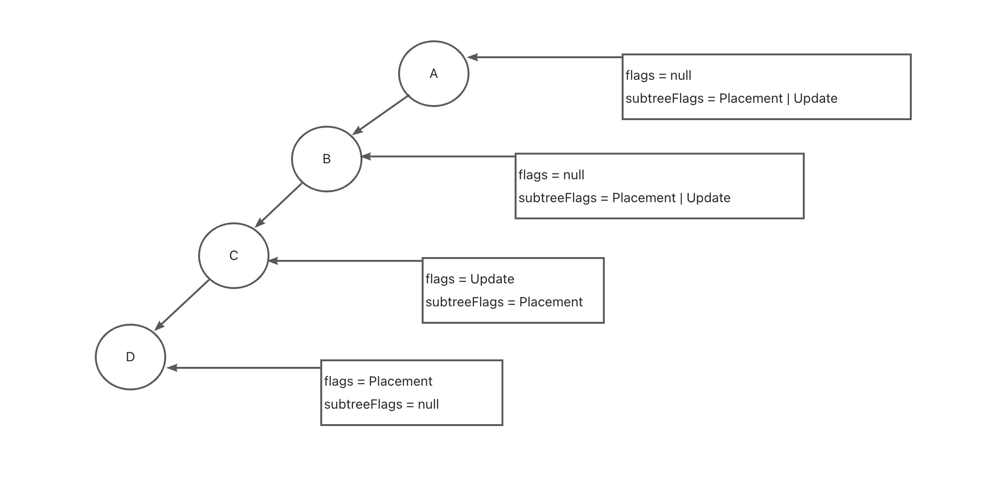
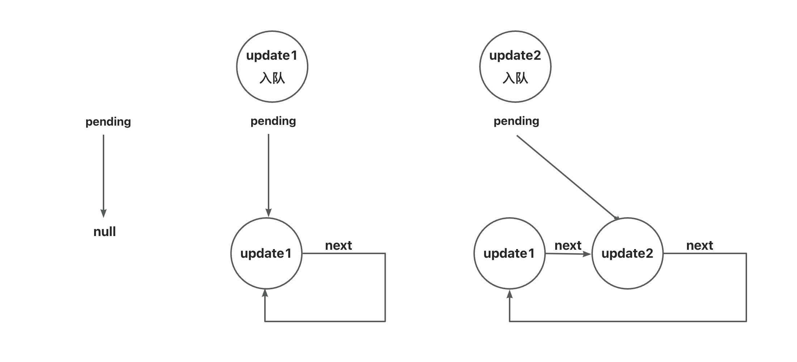
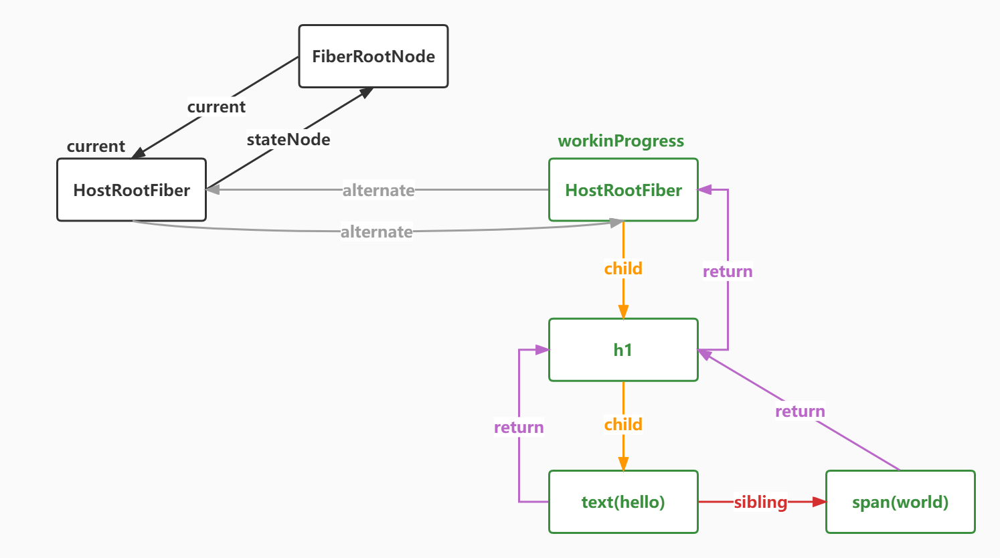

# Fiber

## FiberNode

FiberNode 的数据结构大致如下：
```ts
export class FiberNode {
  tag: WorkTag = null
  key: Key = null
  type: ElementType = null
  stateNode: any = null
  ref: Ref
  pendingProps: Props
  memoizedProps: Props

  child: FiberNode | null
  sibling: FiberNode | null
  return: FiberNode | null

  flags: Flags = null
  subtreeFlags: Flags = null

  updateQueue: unknown
  memoizedState: any

  alternate: FiberNode

  constructor(tag: WorkTag, pendingProps: Props, key: Key) {
    this.tag = tag
    this.pendingProps = pendingProps
    this.key = key
  }
}
```
- tag： 用来表示 Fiber 的类型，如：HostRoot、HostComponent ...
- key： 唯一标识 DOM Diff 的时候会用到
- type： 节点类型，如：div、span
- stateNode： FiberNode 对应的真实 DOM 节点
- child： 第一个儿子节点
- sibling：第一个兄弟节点
- return： 父节点
- flags： 用来表示操作的类型，利用**位运算**
- subtreeFlags： 用来表示子节点的操作类型
- updateQueue：更新队列
- alternate：轮替，双缓存技术

### 位运算
利用二进制来表示每个节点的操作类型，例如：
```ts
const NoFlags = 0b000000000000000000000000 // 不需要操作
export const Placement = 0b000000000000000000000010 // 表示新增操作
```
那么，如果想给一个节点新增一个操作只需要使用: 按位或(|)，判断节点是否有某个操作：按位与(&)。

位运算使用案例：
```ts
const Placement = 0b001;
const Update = 0b010;
//定义操作
let flags = 0b000;
//增加操作
flags |= Placement;
flags |= Update;
console.log(flags.toString(2)); //0b11
//删除操作
flags = flags & ~Placement;
console.log(flags.toString(2)); //0b10
//判断包含
console.log((flags & Placement) === Placement);
console.log((flags & Update) === Update);
//判断不包含
console.log((flags & Placement) === 0);
console.log((flags & Update) === 0);
```

### subtreeFlags 冒泡子节点的更新操作

React 会将当前 FiberNode 的操作类型一层一层的向上冒泡到根节点上。这样，如果一个 FiberNode  的 subtreeFlags = NoFlags，那么就可以表示它的所有子节点都没有任何更新，就不再需要进行遍历，从而提高计算效率。

具体冒泡流程如下：




### alternate 替身

React 存在两个 Fiber 树，一个表示当前页面展示的 Fiber 树，一个表示正在工作的 Fiber 树。alternate 就是当前正在工作的 Fiber 树。当 alternate render 完成之后，会直接将原先的 Fiber 树替换掉，并将其指向 alternate。这样，下次再有更新的时候，会根据 alternate 做 diff 算法，构建新的 Fiber 树，再进行替换，如此反复。

### updateQueue 

updateQueue 用来记录当前节点的更新队列。它的数据结构如下：
```ts
export interface Update {
  payload: any
  next: Update | null
}

export interface UpdateQueue {
  shared: {
    pending: Update | null
  }
}
export function initializeUpdateQueue(fiber: FiberNode) {
  const queue: UpdateQueue = {
    shared: {
      pending: null
    }
  }
  fiber.updateQueue = queue
}
```

`update` 入队的流程大致如下：



- 一开始还没有更新入队， `pengding = null`
- 当第一个更新 `update1` 入队的时候，将 `update1` 的 `next` 指向 `update1`，将 `pending` 指向 `update1`。
- 当第二个更新 `update2` 入队的时候，
  - 首先，将 `update2.next` 指向第一个更新，即 `pengding.next`(此时 pending = update1，所以也就是 update1.next，而 update1.next 又指向 update1，所以 update2.next 指向 update1)。
  - 将 `pengding.next` 指向 `update2`，也就是将 `update1.next` 指向 `update2`
  - 将 `pengding` 指向 `update2`

可以看出，`updateQueue` 也是通过单项链表来实现的，而 `pending` 永远指向的是最后一个更新。

## createRoot

之前我们说过，React 会把 Virtual DOM Tree 转化为 FiberNode Tree，我们知道，每个 React 应用都有一个容器节点 `<div id="root"></div>`，createRoot 方法就是将容器节点转化为 FiberNode。



首先 FiberRootNode 的 数据结构大致如下：
```ts
export class FiberRootNode {
  containerInfo: Container
  current: FiberNode
  constructor(container: Container) {
    this.containerInfo = container
  }
}
```
`containerInfo` 是一个真实的 DOM 节点，即 Demo 中的 `div#root`，`current` 是容器节点所对应的 `FiberNode`，即 `HostRootFiber`。

```ts
function ReactDOMRoot(internalRoot: FiberRootNode) {
  this._internalRoot = internalRoot
}

export function createRoot(container: Container) {
  const root = createContainer(container)
  return new (ReactDOMRoot as any)(root)
}

export function createContainer(container: Container) {
  return createFiberRoot(container)
}

export class FiberRootNode {
  containerInfo: Container
  current: FiberNode
  constructor(container: Container) {
    this.containerInfo = container
  }
}

export function createFiberRoot(containerInfo: Container) {
  const root = new FiberRootNode(containerInfo)
  const uninitializedFiber = createHostRootFiber()

  root.current = uninitializedFiber
  uninitializedFiber.stateNode = root

  return root
}
```
