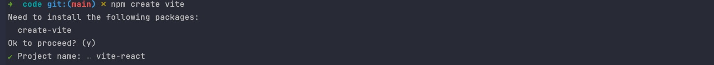
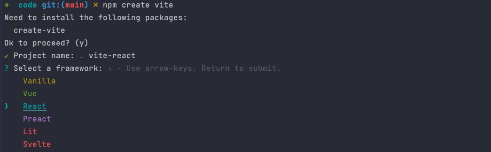
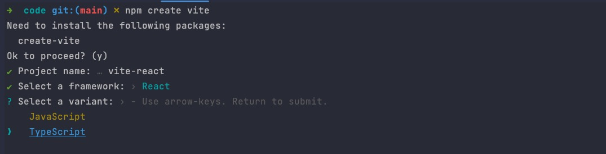
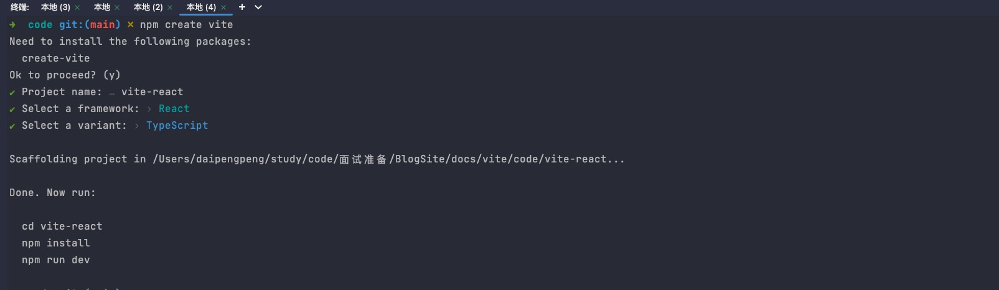
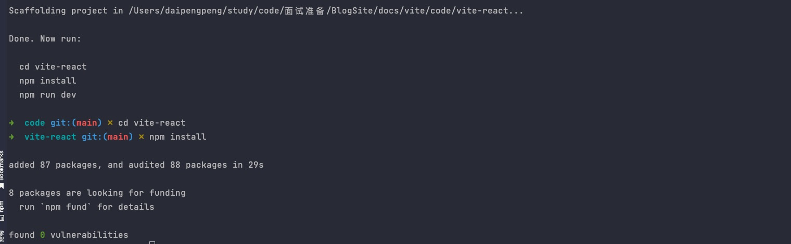
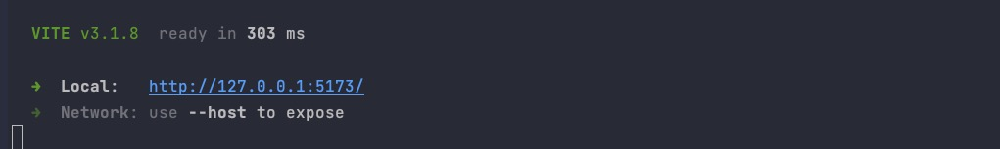
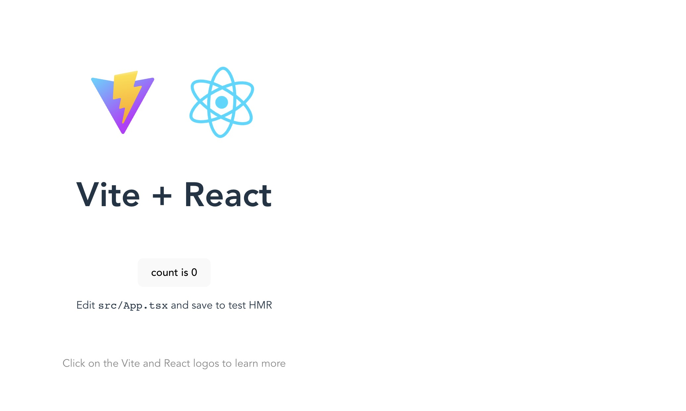
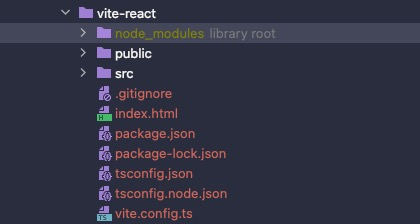

## 一、 使用 Vite 快速搭建项目
本篇文章我们将了解如何使用 Vite 来搭建一个前端项目。

### 环境搭建

浏览器和代码编辑器是必不可少的，推荐大家使用 `VSCode` 和 `Chrome`。

其次，我们还需要确认是否安装 `Node.js`。如果没有安装可以进入 `Node` 官网，选择合适的安装包进行安装。

这里推荐使用 `12.0.0` 以上的版本。

### 项目初始化

在环境搭建完成之后，我们就可以初始化我们的项目来。首先，打开我们的终端命令行工具，输入如下命令：
```shell
npm create vite
```
执行完命令后， npm 会提示我们需要安装第三方 `create-vite`，我们直接 `回车` 确认安装即可。安装完成之后，终端会提示我们输入项目的名称，这里我取名为 `vite-react`，名称输入完成后，`回车` 进入下一步。



这一步是让我们 `选择前端框架`，Vite 内置了几种不同前端框架的脚手架模板供我们选择，我们可以使用 ⬆️ 或 ⬇️ 切换选项，使用 `回车` 确认选择。这里我选择了 `React`。



接下来这一步是让我们选择使用 `JavaScript` 还是 `TypeScript`，这里我选择了 `TypeScript`。



到此，我们的项目就已经创建完成了。



但如果要启动项目，我们还需要安装项目依赖，我们按照终端提示，使用 `cd vite-react(你之前输入的项目名称)` 进入项目目录，使用 `npm install` 安装项目所需要的依赖。



最后，我们使用 `npm run dev` 启动项目，出现如下页面就说明项目启动成功。



终端提示，项目启动在本地 `5173` 端口，我们打开 [http://127.0.0.1:5173/](http://127.0.0.1:5173/)，可以看到如下页面：




### 项目目录结构分析

我们先来看一下项目的整体目录结构：



我们挑选几个重要的文件来说一下它们各自的作用。

#### public

`public` 目录是用来存放静态资源的默认文件夹，我们可以在 `vite.config.ts` 中修改 `publicDir` 来改变。

`public` 目录中的文件开发期可以使用 `/` 来引用，当项目构建的时候，`public` 文件夹下的所有文件会被复制到 `build.outDir`（项目打包输出目录）的根目录。

`public` 目录下的文件会被完整复制到目标目录的根目录下，保持原有文件名，不会被hash。

#### index.html
index.html 是项目的入口文件，也就是说，当你访问 `http://127.0.0.1:5173` 的时候，Vite 的 Dev Server 会自动返回这个 HTML 文件的内容。
```html
<!DOCTYPE html>
<html lang="en">
  <head>
    <meta charset="UTF-8" />
    <link rel="icon" type="image/svg+xml" href="/vite.svg" />
    <meta name="viewport" content="width=device-width, initial-scale=1.0" />
    <title>Vite + React + TS</title>
  </head>
  <body>
    <div id="root"></div>
    <script type="module" src="/src/main.tsx"></script>
  </body>
</html>
```
可以看到，`index.html` 中除了有 `React` 挂载的 `root` 节点外，还有一个 `script` 脚本的引入:

```js
<script type="module" src="/src/main.tsx"></script>
```
由于现代浏览器原生支持了 ES 模块规范，因此原生的 ES 语法也可以直接放到浏览器中执行，只需要在 script 标签中声明` type="module"` 即可。此时相当于请求了 `http://localhost:5173/src/main.tsx` 这个资源，Vite 的 Dev Server 此时会接收到这个请求，然后读取对应的文件内容，进行一定的中间处理，最后将处理的结果返回给浏览器。

#### src

`src` 目录下是存放着我们项目的源码。

`main.tsx` 作为源码的入口文件在 index.html 中被引入。现在，我们来看看 `main.tsx` 文件中的内容。

```tsx
import React from 'react'
import ReactDOM from 'react-dom/client'
import App from './App'
import './index.css'

ReactDOM.createRoot(document.getElementById('root') as HTMLElement).render(
  <React.StrictMode>
    <App />
  </React.StrictMode>
)
```
可能同学们比较诧异，浏览器并不能识别 `tsx` 语法，也无法直接 import css 文件，那么浏览器是如何正常执行的呢？我们之前说过，Vite 的 Dev Server 读取文件后会进行一定的中间处理，也就是在这期间，Vite 对 `main.ts` 中的内容进行来编译，将它转换成浏览器可识别的内容。

需要注意的是，在 Vite 项目中，一个` import 语句即代表一个 HTTP 请求`。Vite Dev Server 会读取本地文件，返回浏览器可以解析的代码。当浏览器解析到新的 import 语句，又会发出新的请求，以此类推，直到所有的资源都加载完成。

#### vite.config.ts
`vite.config.ts` 是 Vite 的配置文件。上文提到的 `build.outDir` 就在此配置。Vite 的配置选项有很多，我们将在下一章来介绍 Vite 一些常用的配置项，或是在官网中查看。[Vite 官网](https://vitejs.cn/)。