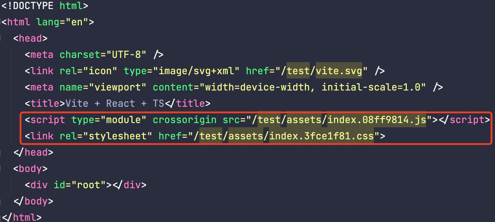
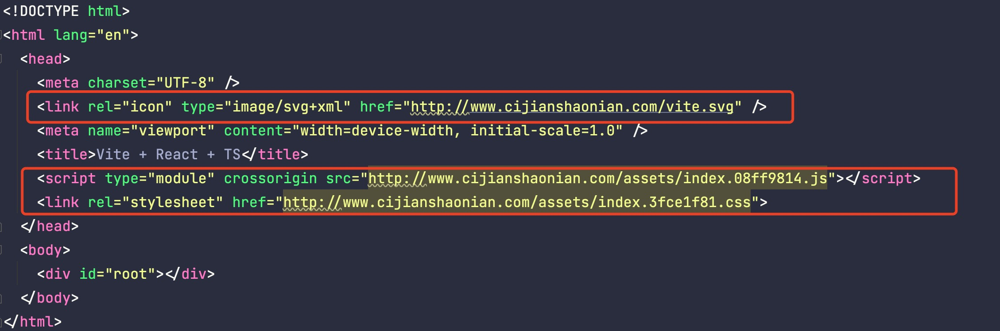
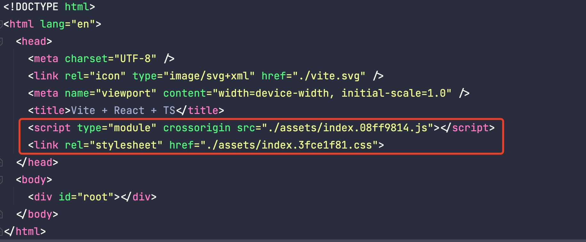
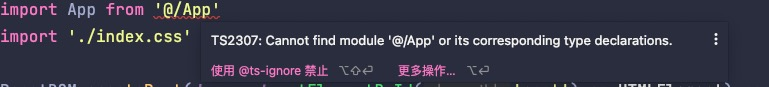

## 前言
本文我们将介绍 Vite 一些常用的简单配置，更多复杂配置将会在后续的文章中一一介绍。

## root
- 类型：string
- 默认值：process.cwd()

项目根目录（index.html 文件所在的位置）。可以是一个绝对路径，或者一个相对于该配置文件本身`(vite.config.ts)`的相对路径。

## base
- 类型：string
- 默认值：/

开发或生产环境服务的公共基础路径。可以是一个绝对 URL 路径名、完整的 URL 地址、空字符串或 `./`

1. 绝对 URL 路径名

```js
// 设置 base 为一个 绝对 URL 路径名
export default defineConfig({
  // ...
  base: '/test/'
})
```
之后，我们查看打包之后的产物，可以发现资源引入的路径都发生来改变



2. 完整的 URL 地址

```js
// 设置 base 为一个 完整的 URL 地址
export default defineConfig({
  // ...
  base: 'http://www.cijianshaonian.com/'
})
```
之后，我们查看打包之后的产物，可以发现资源都是引入指定 `URL` 下的资源



3. 设置 base 为 `./`

```js
// 设置 base 为一个 完整的 URL 地址
export default defineConfig({
  // ...
  base: './'
})
```
之后，我们查看打包之后的产物，可以发现资源都是引入相对路径下的文件



## mode
- 类型：string
- 默认值：'development' 用于开发，'production' 用于构建

用来指定当前是 `开发环境` 还是 `生产环境`

## plugins
- 类型： `(Plugin | Plugin[] | Promise<Plugin | Plugin[]>)[]`

需要用到的插件数组。Falsy 虚值的插件将被忽略，插件数组将被扁平化。

## publicDir
- 类型：string | false
- 默认值：'public' 

publicDir 用来指定静态资源服务的文件夹。 在开发期间，publicDir 目录中的文件以 `/` 开头引用；在构建期间 publicDir 文件夹中的内容会被复制到 outDir 的根目录中。publicDir 可以是文件系统的绝对路径，也可以是相对于项目的根目录的相对路径。

将 publicDir 设为 false 可以关闭此项功能。

## resolve.alas
- 类型：Record<string, string> | Array<{ find: string | RegExp, replacement: string, customResolver?: ResolverFunction | ResolverObject }>

resolve.alas 用来配置路径的别名。**请始终使用绝对路径。相对路径的别名值会原封不动地被使用，因此无法被正常解析。**

例：
```js
import { defineConfig } from 'vite'
import react from '@vitejs/plugin-react'
import * as path from "path";
const resolve = path.resolve

export default defineConfig({
  plugins: [react()],
  resolve: {
    // 写法 1
    alias: {
      '@': resolve(__dirname, 'src')
    }
    // 写法 2
    // alias: [{
    //   find: '@',
    //   replacement: resolve(__dirname, 'src')
    // }]
  }
})
```
以上配置我们给 src 路径设置例别名 @，所以引用 src 下的文件就可以使用 @/*，我们修改一下 main.tsx 中 App 组件的引用：
```text
- import App from './App'
+ import App from '@/App'
```



可以看到编辑器报出了一个错误，这其实是因为我们使用 TS 开发的，TS 并不知道我们的别名系统。所以，还需要在 `tsconfig` 中修改一下配置：
```json
{
  "compilerOptions": {
    "baseUrl": ".",
    "paths": {
      "@/*": ["src/*"]
    }
  }
}
```

## resolve.extensions
- 类型：string[]
- 默认值：['.mjs', '.js', '.ts', '.jsx', '.tsx', '.json']

resolve.extensions 用来配置导入时想要省略的扩展名列表。

:::warning
不建议忽略自定义导入类型的扩展名（例如：.vue），因为它会影响 IDE 和类型支持。
:::

## json.namedExports
- 类型：boolean
- 默认值： true

`json.namedExports` 表示是否支持从 `.json` 文件中进行按名导入。

```json
// config.json
{
  "name": "vite-project"
}
```
```js
// json.namedExports = true
import { name } from 'config.json' // true
import config from 'config.json'   // true

// json.namedExports = false
import { name } from 'config.json' // error
import config from 'config.json'   // true
```

## json.stringify
- 类型：boolean
- 默认值： false

若设置为 true，导入的 JSON 会被转换为 export default JSON.parse("...")，这样会比转译成对象字面量性能更好，尤其是当 JSON 文件较大的时候。

:::warning
`json.stringify` 设置为 true 后，`json.namedExports` 将会被置为 `false`, 即不可按名导入。
:::

## esbuild

## envDir
- 类型：string
- 默认值： root **`注意：这里的 root 表示项目根目录，不是 root 文件夹 ！！！`**

`envDir` 用来表示加载 `.env` 文件的目录。可以是一个绝对路径，也可以是相对于项目根的路径。

Vite 按照以下规则加载额外的环境变量：

```text
.env                # 所有情况下都会加载
.env.local          # 所有情况下都会加载，但会被 git 忽略
.env.[mode]         # 只在指定模式下加载
.env.[mode].local   # 只在指定模式下加载，但会被 git 忽略
```

:::warning
1. 指定模式的文件会比通用形式的优先级高。
2. Vite 执行时已经存在的环境变量有最高的优先级，不会被 .env 类文件覆盖
3. .env 文件在 Vite 启动时被加载，若发生改动，需要重启服务后生效。
:::

Vite 的环境变量都会在 `import.meta.env` 中暴露出来。但是，需要注意的是，Vite 为了防止意外地将一些环境变量泄漏到客户端，默认只有以 `VITE_` 为前缀的变量才会暴露出来。当然，我们也可以通过 `envPrefix` 来修改默认前缀。

例如：
```text
VITE_APP_NAME="vite-project"
APP_NAME="vite-project"

// 只有 VITE_APP_NAME 会被暴露为 import.meta.env.VITE_APP_NAME， 而 APP_NAME 则不会。
```

## envPrefix
- 类型：string | string[]
- 默认值： VITE_

`envPrefix` 用来配置暴露给 import.meta.env 的环境变量前缀。

:::warning
envPrefix 不能被设置为空字符串 ''。这样会暴露所有的环境变量。Vite 检测到配置为 '' 时将会抛出错误。
:::