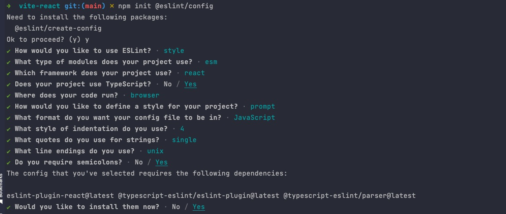

## 前言
本文我们将介绍如何在 Vite 中使用各种 Lint 工具。

## ESLint JS/TS 规范工具

首先我们需要安装 ESLint：
```shell
npm install eslint -D
```
接着执行 ESLint 的初始化命令，并按照提示进行配置选择：
```shell
npx eslint --init
//或者
npm init @eslint/config
```


接着 ESLint 会帮我们自动生成 `.eslintrc.js` 配置文件。

```js
module.exports = {
    // 环境提供预定义的全局变量。
    "env": {
        "browser": true, // 浏览器全局变量
        "es2021": true // 添加所有 ECMAScript 2021 全局变量并自动将 ecmaVersion 解析器选项设置为 12。
    },
    // 需要继承的 eslint 规则集
    "extends": [
        "eslint:recommended",
        "plugin:react/recommended",
        "plugin:@typescript-eslint/recommended"
    ],
    // 解析器 用来解析 typescript
    "parser": "@typescript-eslint/parser",
    // 解析器选项
    "parserOptions": {
        // 表示想使用的额外语言特性
        "ecmaFeatures": {
            "jsx": true
        },
        // es6 版本
        "ecmaVersion": "latest",
        "sourceType": "module"
    },
    // 配置 eslint 插件 这里只是扩展来 eslint 规则，但此时并没有开启规则，需要配置 extends 或者 rule 开启规则
    "plugins": [
        "react",
        "@typescript-eslint" // 添加 TS 规则 @typescript-eslint/eslint-plugin，可省略 `eslint-plugin`
    ],
    "rules": {
        "linebreak-style": [
            "error",
            "unix"
        ],
        "quotes": [
            "error",
            "single"
        ],
        "semi": [
            "error", // error 或 2 表示开启，违背规则后抛出 error； warn 或 1 表示开启，违背规则后警告； off 或 0 表示关闭
            "always" // always 表示必须； never 表示从不
        ]
    },
    "settings": {
        "react": {
            "version": "detect"
        }
    }
}
```

## 配合 Prettier

首先我们来安装一下 Prettier:

```shell
npm install prettier -D
```

在项目根目录新建 `.prettierrc.cjs` 配置文件，填写如下的配置内容:
```js
module.exports = {
  printWidth: 80, //一行的字符数，如果超过会进行换行，默认为80
  tabWidth: 2, // 一个 tab 代表几个空格数，默认为 2 个
  useTabs: false, //是否使用 tab 进行缩进，默认为false，表示用空格进行缩减
  singleQuote: true, // 字符串是否使用单引号，默认为 false，使用双引号
  semi: false, // 行尾是否使用分号，默认为true
  trailingComma: "none", // 是否使用尾逗号
  bracketSpacing: true // 对象大括号直接是否有空格，默认为 true，效果：{ a: 1 }
};
```

接下来我们将Prettier集成到现有的ESLint工具中，首先安装两个工具包:

```shell
npm i eslint-config-prettier eslint-plugin-prettier -D
```

其中 `eslint-config-prettier` 用来覆盖 ESLint 本身的规则配置，而 `eslint-plugin-prettier` 则是用于让 Prettier 来接管 eslint --fix 即修复代码的能力。

在 `.eslintrc.js` 配置文件中接入 prettier 的相关工具链，最终的配置代码如下所示:
```js
module.exports = {
    // 环境提供预定义的全局变量。
    "env": {
        "browser": true, // 浏览器全局变量
        "es2021": true // 添加所有 ECMAScript 2021 全局变量并自动将 ecmaVersion 解析器选项设置为 12。
    },
    // 需要继承的 eslint 规则集
    "extends": [
        "eslint:recommended",
        "plugin:react/recommended",
        "plugin:@typescript-eslint/recommended",
        "prettier",
        "plugin:prettier/recommended"
    ],
    // 解析器 用来解析 typescript
    "parser": "@typescript-eslint/parser",
    // 解析器选项
    "parserOptions": {
        // 表示想使用的额外语言特性
        "ecmaFeatures": {
            "jsx": true
        },
        // es6 版本
        "ecmaVersion": "latest",
        "sourceType": "module"
    },
    // 配置 eslint 插件 这里只是扩展来 eslint 规则，但此时并没有开启规则，需要配置 extends 或者 rule 开启规则
    "plugins": [
        "react",
        "@typescript-eslint", // 添加 TS 规则 @typescript-eslint/eslint-plugin，可省略 `eslint-plugin`
        "prettier"
    ],
    "rules": {
        "prettier/prettier": "error",
        "react/react-in-jsx-scope": "off", // 关掉此规则后 不需要引入 react
        "linebreak-style": [
            "error",
            "unix"
        ],
        "quotes": [
            "error",
            "single"
        ],
        "semi": [
            "error", // error 或 2 表示开启，违背规则后抛出 error； warn 或 1 表示开启，违背规则后警告； off 或 0 表示关闭
            "always" // always 表示必须； never 表示从不
        ]
    },
    "settings": {
        "react": {
            "version": "detect"
        }
    }
}
```

## 在 Vite 中接入 ESLint

首先我们安装 Vite 中的 ESLint 插件:

```shell
npm i vite-plugin-eslint -D
```

然后在 `vite.config.ts` 中接入:
```js
// vite.config.ts
import eslint from 'vite-plugin-eslint';
{
  plugins: [
    eslint(),
  ]
}
```

## Stylelint 样式规范工具

Stylelint 主要专注于样式代码的规范检查。与 ESLint 类似，在规范检查方面，Stylelint 已经做的足够专业，而在代码格式化方面，我们仍然需要结合 Prettier 一起来使用。

首先让我们来安装 Stylelint 以及相应的工具套件：

```shell
npm i stylelint stylelint-prettier stylelint-config-prettier stylelint-config-recess-order stylelint-config-standard stylelint-config-standard-scss -D
```

然后，我们在 Stylelint 的配置文件.stylelintrc.js 中一一使用这些工具套件:

```js
module.exports = {
  // 注册 stylelint 的 prettier 插件
  plugins: ['stylelint-prettier'],
  // 继承一系列规则集合
  extends: [
    // standard 规则集合
    'stylelint-config-standard',
    // standard 规则集合的 scss 版本
    'stylelint-config-standard-scss',
    // 样式属性顺序规则
    'stylelint-config-recess-order',
    // 接入 Prettier 规则
    'stylelint-config-prettier',
    'stylelint-prettier/recommended'
  ],
  // 配置 rules
  rules: {
    // 开启 Prettier 自动格式化功能
    'prettier/prettier': true
  }
};
```

在 Vite 中集成 Stylelint，首先安装依赖

```shell
pnpm i vite-plugin-stylelint -D
```

然后在 Vite 配置文件中添加如下的内容:
```js
import viteStylelint from 'vite-plugin-stylelint';

{
  plugins: [
    viteStylelint({
      // ...options
    }),
  ]
}
```

## Husky + lint-staged 的 Git 提交工作流集成

首先我们需要安装一下 husky 这个工具:

```shell
npm i husky -D
```

值得提醒的是，有很多人推荐在package.json中配置 husky 的钩子:

```json
// package.json
{
  "husky": {
    "pre-commit": "npm run lint"
  }
}
```
这种做法在 Husky 4.x 及以下版本没问题，而在最新版本(7.x 版本)中是无效的！在新版 Husky 版本中，我们需要做如下的事情:

1. 初始化 Husky: npx husky install，并将 husky install 作为项目启动前脚本，如:

```json
{
  "scripts": {
    // 会在安装 npm 依赖后自动执行
    "prepare": "husky install"
  }
}
```

2. 添加 Husky 钩子，在终端执行如下命令:
3. 
```shell
npx husky add .husky/pre-commit "npm run lint"
```

接着你将会在项目根目录的 .husky 目录中看到名为 pre-commit 的文件，里面包含了 git commit 前要执行的脚本。现在，当你执行 git commit 的时候，会首先执行 npm run lint脚本，通过 Lint 检查后才会正式提交代码记录。

不过，刚才我们直接在 Husky 的钩子中执行 npm run lint，这会产生一个额外的问题: Husky 中每次执行 npm run lint 都对仓库中的代码进行全量检查，也就是说，即使某些文件并没有改动，也会走一次 Lint 检查，当项目代码越来越多的时候，提交的过程会越来越慢，影响开发体验。

而 lint-staged 就是用来解决上述全量扫描问题的，可以实现只对存入暂存区的文件进行 Lint 检查，大大提高了提交代码的效率。首先，让我们安装一下对应的 npm 包:

```shell
npm i -D lint-staged
```

然后在 package.json中添加如下的配置:

```json
{
  "lint-staged": {
    "**/*.{js,jsx,tsx,ts}": [
      "npm run lint:script",
      "git add ."
    ],
    "**/*.{scss}": [
      "npm run lint:style",
      "git add ."
    ]
  }
}
```

接下来我们需要在 Husky 中应用 lint-stage，回到 .husky/pre-commit 脚本中，将原来的 npm run lint 换成如下脚本:

```shell
npx --no -- lint-staged
```

如此一来，我们便实现了提交代码时的增量 Lint 检查。

## Commit 信息规范

除了代码规范检查之后，Git 提交信息的规范也是不容忽视的一个环节，规范的 commit 信息能够方便团队协作和问题定位。首先我们来安装一下需要的工具库，执行如下的命令:

```shell
npm i commitlint @commitlint/cli @commitlint/config-conventional -D
```

接下来新建 .commitlintrc.js ：

```js
// .commitlintrc.js
module.exports = {
  extends: ["@commitlint/config-conventional"]
};
```

一般我们直接使用 @commitlint/config-conventional 规范集就可以了，它所规定的 commit 信息一般由两个部分: type 和 subject 组成，结构如下:

```js
// type 指提交的类型
// subject 指提交的摘要信息
<type>: <subject>
```

常用的 type 值包括如下:

- feat: 添加新功能。
- fix: 修复 Bug。 
- chore: 一些不影响功能的更改。
- docs: 专指文档的修改。
- perf: 性能方面的优化。
- refactor: 代码重构。
- test: 添加一些测试代码等等。

接下来我们将 commitlint 的功能集成到 Husky 的钩子当中，在终端执行如下命令即可:

npx husky add .husky/commit-msg "npx --no-install commitlint -e $HUSKY_GIT_PARAMS"

你可以发现在.husky目录下多出了 commit-msg 脚本文件，表示 commitlint 命令已经成功接入到 husky 的钩子当中。现在我们可以尝试对代码进行提交，假如输入一个错误的 commit 信息，commitlint 会自动抛出错误并退出。

至此，我们便完成了 Git 提交信息的卡点扫描和规范检查。

