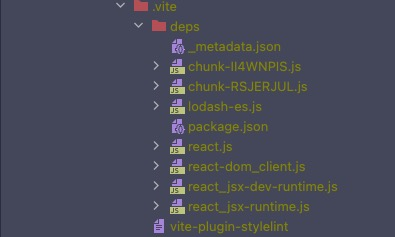
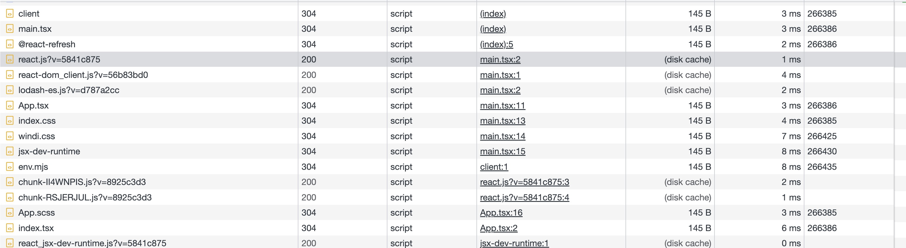
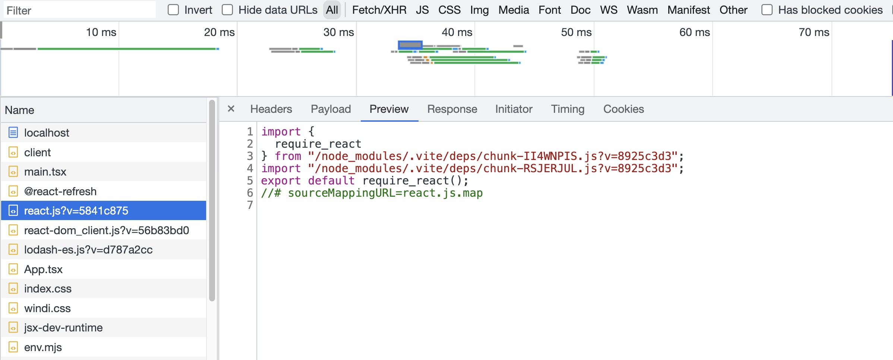
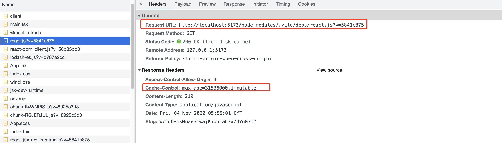

## 前言
本文我们将介绍 Vite 如何进行依赖预构建。

## 为什么需要预构建 [](https://cn.vitejs.dev/guide/dep-pre-bundling.html)
首先，Vite 的 Dev Server 是基于浏览器原生 ES 模块规范实现。所以，不论是我们的源码还是第三方依赖的代码，都必须符合 ESM 规范。 然而，很多第三方依赖仍然没有 ES 版本的产物，所以需要将它转换成 ESM 格式的产物。

其次，我们知道 Vite 中每一个 import 都会变成一个 HTTP 请求，有些第三方库会依赖很多其他模块。那么在加载的时候就会发出很多请求，由于 HTTP 的连接数限制，这就可能会导致页面的卡顿。

## 如何开启预构建

在 Vite 中有两种开启预构建的方式，分别是自动开启和手动开启。


### 自动开启

当我们项目启动完成之后，打开 `node_modules` 目录，可以发现 `node_modules` 下多了一个 `.vite` 目录：



其实 `.vite` 目录下存放就是预构建产物文件。

打开页面，开启 `Dev Tools`，选择 `Network`  



可以看到浏览器加载了很多 JS 文件，我们选中其中的 `react.js` 看一下，可以发现 react 的引入路径已经被重写



并且，该文件被设置为缓存一年过期。那么，下次再访问该文件的时候会直接走浏览器缓存，并不会再经过 Vite Dev Server。


`.vite` 目录中的缓存文件会在以下几种情况下发生更新：
1. package.json 的 `dependencies` 字段发生改变
2. 各种包管理器的 lock 文件发生改变
3. `optimizeDeps` 配置内容被修改

### 手动开启

上面提到了预构建中本地文件系统的产物缓存机制，而少数场景下我们不希望用本地的缓存文件，比如需要调试某个包的预构建结果，我推荐使用下面任意一种方法清除缓存，还有手动开启预构建:
1. 删除 `node_modules/.vite` 目录。
2. 在 Vite 配置文件中，将 `optimizeDeps.force` 设为 `true`
3. 命令行执行 `npx vite --force` 或者 `npx vite optimize`。

## optimizeDeps 配置详解

### 入口文件 entries

默认情况下，Vite 会抓取你的 index.html 来检测需要预构建的依赖项。如果指定了 build.rollupOptions.input，Vite 将转而去抓取这些入口点。

如果这两者都不合你意，则可以使用此选项指定自定义条目——该值需要遵循 fast-glob 模式 ，或者是相对于 Vite 项目根目录的匹配模式数组。当显式声明了 optimizeDeps.entries 时默认只有 node_modules 和 build.outDir 文件夹会被忽略。如果还需忽略其他文件夹，你可以在模式列表中使用以 ! 为前缀的、用来匹配忽略项的模式。

### 排除依赖 exclude

`exclude` 用来 在预构建中强制排除的依赖项。

```js
export default defineConfig({
  optimizeDeps: {
    exclude: ['lodash-es']
  }
})
```
### 添加依赖 include

`include` 用来指明需要强制预构建的依赖项。
```js
export default defineConfig({
  optimizeDeps: {
    include: ['lodash-es']
  }
})
```

`inclued` 使用场景: 动态 import

```js
// src/locales/zh_CN.ts
import objectAssign from "object-assign";

// main.tsx
const importModule = (m) => import(`./locales/${m}.ts`);
importModule("zh_CN");
```

在这个例子中，动态 import 的路径只有运行时才能确定，无法在预构建阶段被扫描出来。因此，Vite 运行时发现了新的依赖，随之重新进行依赖预构建，并刷新页面。这个过程也叫**二次预构建**。在一些比较复杂的项目中，这个过程会执行很多次。

然而，二次预构建的成本也比较大。我们不仅需要把预构建的流程重新运行一遍，还得重新刷新页面，并且需要重新请求所有的模块。尤其是在大型项目中，这个过程会严重拖慢应用的加载速度！因此，我们要尽力避免运行时的二次预构建。我们可以通过 `include` 参数提前声明需要按需加载的依赖。

```js
// vite.config.ts
{
  optimizeDeps: {
    include: [
      // 按需加载的依赖都可以声明到这个数组里
      "object-assign"
    ];
  }
}
```

### esbuildOptions

`esbuildOptions` 参数在预购的时候将传递给 esbuild 的选项。

需要注意的是，某些选项进行了省略，因为修改它们与 Vite 的优化方案并不兼容。

- 忽略了 `external` 选项，请使用 Vite 的 `optimizeDeps.exclude` 选项
- plugins 与 Vite 的 dep 插件合并

### force

设置为 true 可以强制依赖预构建，而忽略之前已经缓存过的、已经优化过的依赖。