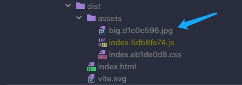
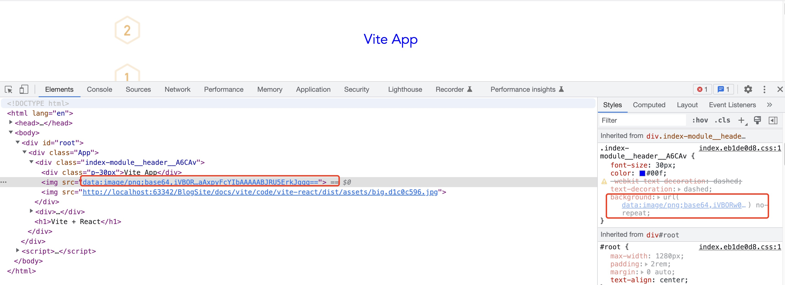

## 前言
本文我们将介绍如何在 Vite 中处理图片资源。

## 加载图片资源

在 Vite 中使用图片资源并不需要额外的配置，可以直接使用:

```tsx
// 在 img 标签中使用
import React from 'react';
import style from './index.module.scss';
import imgUrl from '@/assets/images/1.png';
import bigimgUrl from '@/assets/images/big.jpg';

export default function Header() {
  return (
    <div className={style.header}>
      <div className="p-30px">Vite App</div>
      
      
    </div>
  );
}
```
```scss
// 在 css 中使用
.header {
  font-size: 30px;
  color: blue;
  text-decoration: dashed;
  background: url('@/assets/images/2.png') no-repeat;
}
```
接下来，我们执行一次 build 命令：

```shell
npm run build
```

然后，查看一下打包产物：



可以发现，我们虽然通过 import 导入了两个图片，并且全部使用。但是，打包后只有 big.jpg 一个文件资源。那么 1.png 资源哪里去了呢？

我们使用浏览器打开 dist/index.html：



可以发现，图片被打包成 base64 格式的字符串内联到 html 里面了。

实际上，Vite 默认会将 < 4kb 的图片作为 base64 格式的字符串内联，而 >= 4kb 的图片会提取成单独的文件。

当然，我们也可以通过 `build.assetsInlineLimit` 配置这个临界值。

## 压缩图片

我们在项目中经常会大量使用图片资源。如果图片资源过大，那么会增加项目整体打包产物的体积。所以，我们需要对图片进行一定的压缩。在 vite 中，我们可以使用 `vite-plugin-imagemin` 来压缩图片。

首先我们来安装 `vite-plugin-imagemin`:

```shell
npm i vite-plugin-imagemin -D
```

随后在 Vite 配置文件中引入:

```js
//vite.config.ts
import viteImagemin from 'vite-plugin-imagemin';

{
  plugins: [
    // 忽略前面的插件
    viteImagemin({
      // 无损压缩配置，无损压缩下图片质量不会变差
      optipng: {
        optimizationLevel: 7
      },
      // 有损压缩配置，有损压缩下图片质量可能会变差
      pngquant: {
        quality: [0.8, 0.9],
      },
      // svg 优化
      svgo: {
        plugins: [
          {
            name: 'removeViewBox'
          },
          {
            name: 'removeEmptyAttrs',
            active: false
          }
        ]
      }
    })
  ]
}
```