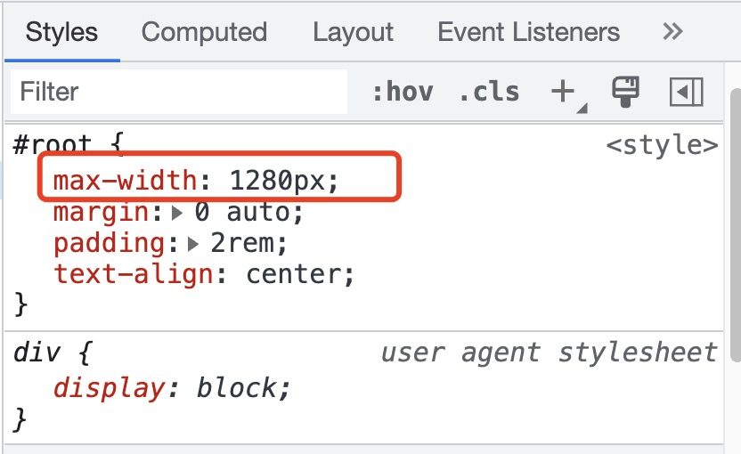
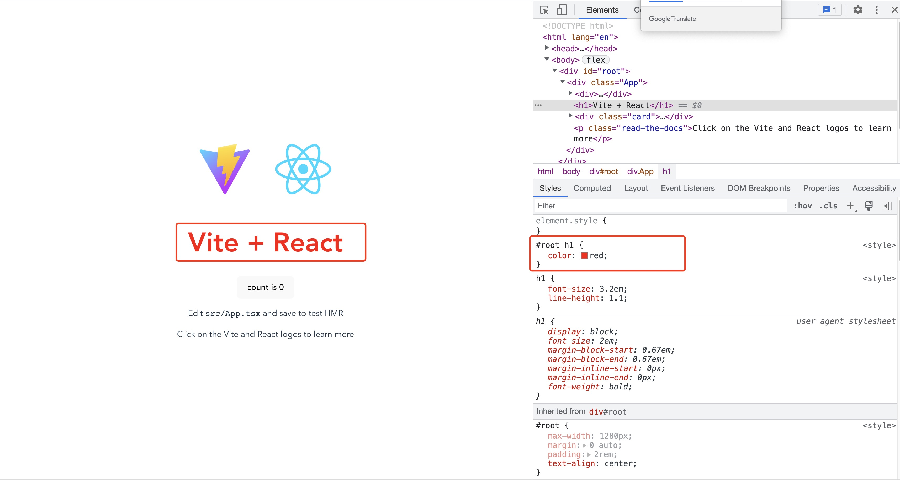
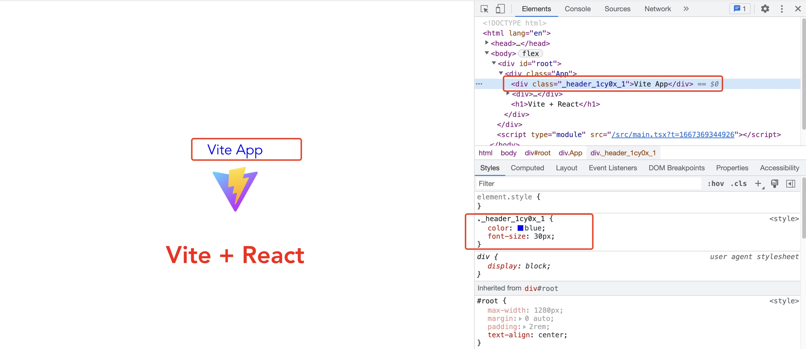
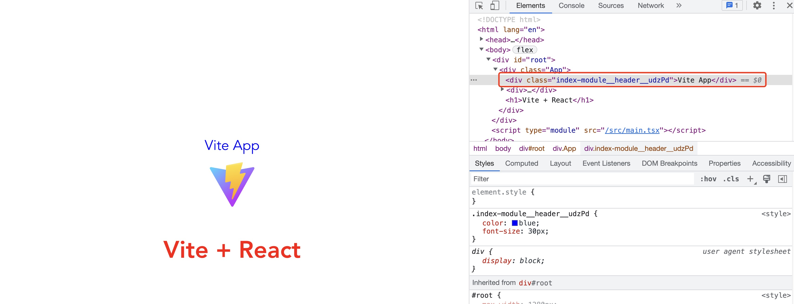

## 前言
本文我们将介绍如何在 Vite 中接入现代化 CSS 解决方案。

## CSS 预处理器

### 1. 使用 sass

Vite 默认对 Sass、Less、Stylus 预处理器做了支持，所以说我们无需配置就可以直接使用。不过，在使用之前我们需要先安装一下对应依赖。这里我们以 sass 为例：

首先使用 npm 安装 sass：
```shell
npm install sass -D
```
接下来，我们把 `App.css` 文件后缀名改为 `.scss`，并修改 `App.tsx` 中的引入路径，启动项目可以发现页面正常显示。

修改 `App.scss` 文件中的代码，加入一些 `scss` 特性：
```scss
$wrap-width: 1280px;

#root {
  max-width: $wrap-width;
  margin: 0 auto;
  padding: 2rem;
  text-align: center;

  .logo {
    height: 6em;
    padding: 1.5em;
    will-change: filter;
  }
}
```
可以发现 CSS 被正确解析来。



### 2. 配置全局 Scss 变量

接下来，我们创建 `styles` 文件夹，并在文件夹下创建 `variable.scss`
```scss
$theme-color: red;
```
在 `App.scss` 中引入 `variable.scss`
```scss
@import "@/styles/variable.scss";

$wrap-width: 1280px;

#root {
  max-width: $wrap-width;
  margin: 0 auto;
  padding: 2rem;
  text-align: center;

  .logo {
    height: 6em;
    padding: 1.5em;
    will-change: filter;
  }

  h1{
    color: $theme-color; // 此处使用 variable 中定义的变量
  }
}
```


但是， `variable.scss` 中的变量会在很多样式文件中被使用，如果每次使用都需要引入一遍会显得很繁琐，Vite 给我们提供了自动引入的方案。接下来，我们对 Vite 配置进行修改：

```js
import { defineConfig, normalizePath } from 'vite'
import react from '@vitejs/plugin-react'
import * as path from "path";
const resolve = path.resolve

// 全局 scss 文件路径
// 用 normalizePath 解决 window 下的路径问题
const variableScssPath = normalizePath(resolve(__dirname, './src/styles/variable.scss'))

export default defineConfig({
  plugins: [react()],
  base: './',
  resolve: {
    alias: {
      '@': resolve(__dirname, 'src')
    }
  },
  css: {
    preprocessorOptions: {
      scss: {
        // additionalData 的内容会在每个 scss 文件的开头自动注入
        additionalData: `@import "${variableScssPath}";`
      }
    }
  }
})
```
现在，我们可以把 `App.scss` 中的 `@import "@/styles/variable.scss";` 语句删掉，再次刷新页面，依然可以正确渲染。

## CSS Module

CSS Module 在 Vite 中也是可以直接使用的，Vite 会对后缀带有 `.module` 的样式文件自动应用 `CSS Module`。接下来我们一起来看一个简单的例子。

首先，我们创建一个组件文件夹 `components`，并创建组件 `header`，在 `header` 中 创建 `index.module.scss`。

```text
- components
|    - header
|       - index.tsx
|       - index.module.scss
```
```scss
// index.module.scss
.header {
  color: blue;
  font-size: 30px;
}
```
在 index.tsx 中我们引用 `index.module.scss`
```tsx
import style from './index.module.scss'

export  default function Header() {
  return <div className={style.header}>Vite App</div>
}
```
打开页面，可以看到标签 `div` 的类名已经被处理成了哈希值的形式：



我们也可以在 vite.config 中配置 `class` 生成的规则：
```ts
export default defineConfig({
  // 省略其他配置
  css: {
    // 通过 generateScopedName 属性来对生成的类名进行自定义
    modules: {
      // 其中，name 表示当前文件名，local 表示类名
      generateScopedName: "[name]__[local]__[hash:base64:5]"
    }
  }
})
```
刷新页面，我们可以发现类名已经根据我们定义的规则生成:



## PostCSS

Vite 自身已经集成 PostCSS，无需再次安装。另外也无需单独创建PostCSS配置文，可以直接在 Vite 配置文件中进行配置。

```ts
export default defineConfig({
  // 省略其他配置
  css: {
    postcss: {
      // 插件数组
      plugins: []
    }
  }
})
```

接下来，我们安装一个常用的 PostCSS 插件 `autoprefixer`: 
```shell
npm install autoprefixer -D
```
这个插件主要用来自动为不同的目标浏览器添加样式前缀，解决的是浏览器兼容性的问题。接下来我们修改一下 Vite 配置文件来接入这个插件:
```ts
export default defineConfig({
  // 省略其他配置
  css: {
    postcss: {
      plugins: [
        autoprefixer({
          // autoprefixer 配置参数
        })
      ]
    }
  }
})
```
之后，我们可以看到 `css` 文件发生来变化，自动加上了样式前缀：

```css
.index-module__header__A6CAv{
    color:#00f;font-size:30px;
    -webkit-text-decoration:dashed;
    text-decoration:dashed
}
```

其他常见的 `PostCSS` 插件：
- [postcss-pxtorem](https://github.com/cuth/postcss-pxtorem): 用来将 px 转换为 rem 单位，在适配移动端的场景下很常用。
- [postcss-preset-env](https://github.com/csstools/postcss-preset-env): 通过它，你可以编写最新的 CSS 语法，不用担心兼容性问题。
- [cssnano](https://github.com/cssnano/cssnano): 主要用来压缩 CSS 代码，跟常规的代码压缩工具不一样，它能做得更加智能，比如提取一些公共样式进行复用、缩短一些常见的属性值等等。

更多 PostCSS 插件：[PostCSS](https://www.postcss.parts/)

##  Windi CSS
首先安装 `Windi CSS` 和对应的 `Vite` 插件：
```shell
npm install windicss vite-plugin-windicss -D
```
随后我们在配置文件中来使用它:
```ts
// vite.config.ts
import { defineConfig, normalizePath } from 'vite'
import react from '@vitejs/plugin-react'

import windi from "vite-plugin-windicss";

export default defineConfig({
  // 省略其他配置
  plugins: [react(), windi()]
})
```
在 `src/main.tsx` 中引入一个必需的 import 语句:
```ts
// 用来注入 Windi CSS 所需的样式
import "virtual:windi.css";
```
接下来，我们就可以愉快的使用 `windi css` 了：
```tsx
import style from './index.module.scss'

export  default function Header() {
  return <div className={style.header}>
    <div className='p-30px'>Vite App</div>
  </div>
}
```
更多 `windi css` 的高级用法可以查看[官方文档](https://windicss.org/)。


## Tailwind CSS 

我们可以参照 `Tailwind CSS` 官网教程[](https://tailwindcss.com/docs/guides/vite)来接入 `Tailwind CSS`，或者切换到 `vite-tailwind-css` 分支查看。

首先安装 `tailwindcss` 及其必要的依赖:

```shell
npm install -D tailwindcss postcss autoprefixer
```

然后新建配置文件tailwind.config.cjs 和 postcss.config.cjs:
```js
// tailwind.config.cjs
module.exports = {
  content: [
    "./index.html",
    "./src/**/*.{vue,js,ts,jsx,tsx}",
  ],
  theme: {
    extend: {},
  },
  plugins: [],
}

// postcss.config.cjs
// 注意: Vite 配置文件中如果有 PostCSS 配置的情况下会覆盖掉 post.config.cjs 的内容!
module.exports = {
  plugins: {
    tailwindcss: {},
    autoprefixer: {},
  },
}
```

接着在项目的入口 CSS 中引入必要的样板代码:
```css
@tailwind base;
@tailwind components;
@tailwind utilities;
```
接下来，我们就可以在项目中使用 `Tailwind` 样式了。

更多 `Tailwind CSS` 的高级用法可以查看[官方文档](https://www.tailwindcss.cn/)。